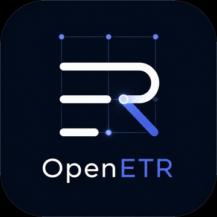

# OpenETR — Durable Control. Portable Records.
Transfer, endorsement, and enforcement—without dependence on systems.



## Overview

OpenETR is an open source project to define and implement a minimal, interoperable layer for electronic transferable records—records whose control can be exercised, proven, and transferred without reliance on any single institution, platform, or registry.
At its core, OpenETR treats control as the operative fact and records as its visible surface. Rather than binding authority to systems, OpenETR binds it to verifiable control structures that can persist, move, and be independently validated across environments.
The result is a portable, durable foundation for digital instruments such as bills of lading, warehouse receipts, promissory notes, certificates, and other records that must carry authority and change hands.

## Problem

Digital records today are typically:

* System-bound — tied to specific platforms, vendors, or registries
* Non-transferable by design — movement requires intermediaries or reissuance
* Difficult to verify independently — validation depends on the originating system
* Fragile over time — persistence depends on institutional continuity

This creates friction for any record that must function like a thing that can be held, transferred, and relied upon.

## Proposal

OpenETR introduces a simple model for records that are:

* Durable — persist independently of any single system
* Portable — transferable without loss of meaning or authority
* Verifiable — independently provable through cryptographic control
* Composable — usable across applications, jurisdictions, and infrastructures

OpenETR does not replace legal or institutional frameworks. It provides a technical substrate upon which they can operate more directly and with less dependency.

## Core Model

OpenETR reduces the system to three primitives:

* Objects (Records) — the thing that carries meaning and authority
* Controllers (Keys) — the entity exercising exclusive control
* Events (Actions) — transfers, endorsements, and attestations

From these, OpenETR enables three fundamental operations:
* Transfer — movement of control from one controller to another
* Endorsement — assignment of meaning, recognition, or delegation
* Enforcement — recognition of control with binding effect

Together, these form a minimal fabric where:
control persists, records travel, and meaning accumulates

## Design Principles

Control over ownership — ownership is derived; control is observable

* Independence by design — no reliance on centralized registries or authorities
* Cryptographic verifiability — proofs are portable and machine-checkable
* Protocol simplicity — minimal primitives, maximal composability
* Interoperability — compatible with existing legal and technical frameworks

## Scope
The OpenETR project will deliver:

* A reference specification for transferable records
* A canonical data model for objects, controllers, and events
* Open APIs and SDKs for creating and transferring records

Reference implementations (e.g., Python, TypeScript)

Integration patterns for systems such as decentralized networks and traditional registries

## Specifications

Draft specifications and supporting documents live in [docs/specs/INDEX.md](docs/specs/INDEX.md).

## Posts

Long-form project writing and essay-style articles live in [docs/posts/index.md](docs/posts/index.md).

## Use Cases

* Electronic bills of lading and trade documents
* Warehouse receipts and inventory claims
* Promissory notes and financial instruments
* Digital certificates and credentials with transfer semantics
* Cross-border record portability and verification

## Why Open Source
Transferable records require shared understanding and independent verification. An open source approach ensures:

* Transparency of rules and behavior
* Broad interoperability across ecosystems
* Avoidance of vendor lock-in
* Community-driven evolution

## Vision
OpenETR establishes a foundation where:


* Records are not confined to systems
* Control is durable and transferable
* Authority can be exercised and verified anywhere

A world where:
* records stand on their own, and control moves with them

## Nostr Implementation (Initial)

OpenETR includes an initial implementation on Nostr to demonstrate durable control and portable records using existing open infrastructure.

Nostr provides a simple model of signed events + relay distribution + independent verification. OpenETR is best understood as a scheme built on the Nostr protocol, defining how those events represent records, control, and transfer.

## CLI Example

The current CLI can issue, transfer, encumber, discharge, redeem, terminate, and query OpenETR records using the Nostr `31415` / `31416` event-family model.

For a focused spec-to-implementation walkthrough, see [OPENETR_CLI_IMPLEMENTATION_WALKTHROUGH.md](docs/specs/OPENETR_CLI_IMPLEMENTATION_WALKTHROUGH.md).

A minimal flow looks like:

```bash
openetr profile use warehouse
openetr issue-etr examples/MLWR001.pdf
openetr query-etr examples/MLWR001.pdf
```

Transfer control to another profile:

```bash
openetr transfer initiate examples/MLWR001.pdf --transferee exporter
openetr profile use exporter
openetr transfer accept examples/MLWR001.pdf
openetr query-etr examples/MLWR001.pdf
```

Query output includes the origin event, matching control events, lifecycle state, current controller, profile information where available, and encumbrance summaries.

## Get Involved
OpenETR is an open invitation to developers, legal experts, standards bodies, and institutions to collaborate on a shared layer for transferable records.
Contributions are welcome across:

* Specification design
* Reference implementations
* Legal and regulatory alignment
* Real-world pilots and integrations


OpenETR — Durable Control. Portable Records.
