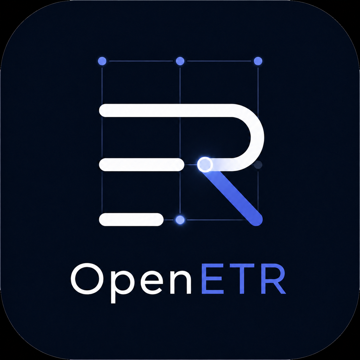

# OpenETR — Durable Control. Portable Records.
Transfer, endorsement, and enforcement—without dependence on systems.



## Overview

OpenETR is an open source project to define and implement a minimal, interoperable layer for electronic transferable records—records whose control can be exercised, proven, and transferred without reliance on any single institution, platform, or registry.
At its core, OpenETR treats control as the operative fact and records as its visible surface. Rather than binding authority to systems, OpenETR binds it to verifiable control structures that can persist, move, and be independently validated across environments.
The result is a portable, durable foundation for digital instruments such as bills of lading, warehouse receipts, promissory notes, certificates, and other records that must carry authority and change hands.

## Problem

Digital records today are typically:

* System-bound — tied to specific platforms, vendors, or registries
* Non-transferable by design — movement requires intermediaries or reissuance
* Difficult to verify independently — validation depends on the originating system
* Fragile over time — persistence depends on institutional continuity

This creates friction for any record that must function like a thing that can be held, transferred, and relied upon.

## Proposal

OpenETR introduces a simple model for records that are:

* Durable — persist independently of any single system
* Portable — transferable without loss of meaning or authority
* Verifiable — independently provable through cryptographic control
* Composable — usable across applications, jurisdictions, and infrastructures

OpenETR does not replace legal or institutional frameworks. It provides a technical substrate upon which they can operate more directly and with less dependency.

## Core Model

OpenETR organizes the system around three primitives and one derived concept:

* Digital Artifacts — persistent content identified by digest
* Digital Controllable Records — one end-verifiable record or a graph of related records concerning an artifact
* Consequential State — state derived by applying defined rules to the available DCR evidence
* Digital Originals — Digital Artifacts for which consequential state has been established through a DCR

These terms are intentionally separate. A warehouse receipt, bill of lading,
certificate, or credential is a Digital Artifact. Signed events concerning it
form its candidate Digital Controllable Record. OpenETR validates that evidence
and derives consequential state; recognition of the result remains external.

OpenETR control actions can transfer control, record encumbrances and
discharges, support redemption, and end a record lifecycle. Attestations and
external recognition evidence can inform how a relying party evaluates the
result without becoming control merely because they were published.

## Consequential State Architecture

OpenETR follows a simple governing principle:

> Consequential state should be derived from end-verifiable events, not
> asserted solely by applications.

A Digital Artifact has uniquely identifiable persistent content, normally
bound to a cryptographic digest. A Digital Controllable Record establishes and
transitions consequential state concerning it. It becomes a Digital Original
when consequential state can be derived by applying OpenETR rules to the valid
DCR evidence.
Applications may cache and display projections of that state, but they are not
its sole authority.

Recognition and effect remain separate. OpenETR can establish portable,
independently reconstructable protocol state without claiming that every
institution, community, contract, or jurisdiction must recognize it.

See the
[Consequential State Architecture Design Note](docs/specs/CONSEQUENTIAL_STATE_ARCHITECTURE_DESIGN_NOTE.md).

## Design Principles

Control over ownership — ownership is derived; control is observable

* Independence by design — no reliance on centralized registries or authorities
* Cryptographic verifiability — proofs are portable and machine-checkable
* Protocol simplicity — minimal primitives, maximal composability
* Interoperability — compatible with existing legal and technical frameworks

## Scope
The OpenETR project will deliver:

* A reference specification for transferable records
* A canonical data model for objects, controllers, and events
* Open APIs and SDKs for creating and transferring records

Reference implementations (e.g., Python, TypeScript)

Integration patterns for systems such as decentralized networks and traditional registries

## Specifications

Draft specifications and supporting documents live in [docs/specs/INDEX.md](docs/specs/INDEX.md).

## Posts

Long-form project writing and essay-style articles live in [docs/posts/index.md](docs/posts/index.md).

## Use Cases

* Electronic bills of lading and trade documents
* Warehouse receipts and inventory claims
* Promissory notes and financial instruments
* Digital certificates and credentials with transfer semantics
* Cross-border record portability and verification

## Why Open Source
Transferable records require shared understanding and independent verification. An open source approach ensures:

* Transparency of rules and behavior
* Broad interoperability across ecosystems
* Avoidance of vendor lock-in
* Community-driven evolution

## Vision
OpenETR is an open protocol for deriving consequential state from
end-verifiable evidence concerning exact Digital Artifacts, independently of
the applications, organizations, and legal regimes that use or recognize that
state.

The governing discipline is:

> Each proof proves only what it proves.

OpenETR establishes a foundation where records are not confined to systems,
control evidence remains portable, and another implementation can reproduce a
state determination from the signed evidence and identified rules.

## Nostr Implementation (Initial)

OpenETR includes an initial implementation on Nostr to demonstrate durable control and portable records using existing open infrastructure.

Nostr provides a simple model of signed events + relay distribution + independent verification. OpenETR is best understood as a scheme built on the Nostr protocol, defining how those events become control records linked into an object-centric control graph.

## CLI Example

The current CLI can create an initial control record, transfer, encumber,
discharge, redeem, terminate, and query OpenETR control graphs using regular
Nostr event kinds `1415` and `1416`. Kinds `31415` and `31416` are deprecated
prototype kinds.

For a focused spec-to-implementation walkthrough, see [OPENETR_CLI_IMPLEMENTATION_WALKTHROUGH.md](docs/specs/OPENETR_CLI_IMPLEMENTATION_WALKTHROUGH.md).

A minimal flow looks like:

```bash
openetr profile use warehouse
openetr issue examples/MLWR001.pdf
openetr query examples/MLWR001.pdf
```

Transfer control to another profile:

```bash
openetr transfer initiate examples/MLWR001.pdf --transferee exporter
openetr profile use exporter
openetr transfer accept examples/MLWR001.pdf
openetr query examples/MLWR001.pdf
```

Query output includes the origin event, matching control events, lifecycle state, current controller, profile information where available, and encumbrance summaries.

## Get Involved
OpenETR is an open invitation to developers, legal experts, standards bodies, and institutions to collaborate on a shared layer for transferable records.
Contributions are welcome across:

* Specification design
* Reference implementations
* Legal and regulatory alignment
* Real-world pilots and integrations


OpenETR — Durable Control. Portable Records.
