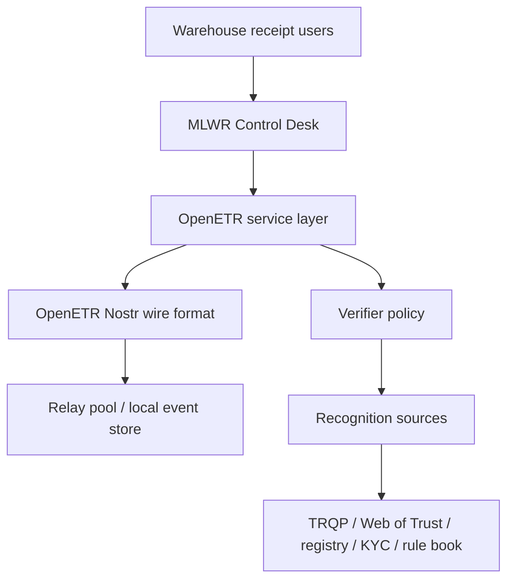

# Architecture

The MLWR Control Desk is a domain adapter over the general OpenETR control layer.

## Layer Model

## Domain Adapter

The webapp speaks warehouse receipt language:

- issue receipt;
- current holder/controller;
- pledge or lien;
- release;
- presentation for delivery;
- completed lifecycle.

It translates those concepts into generic OpenETR service calls.

## OpenETR Core

The OpenETR component remains general.

It works with:

- digests;
- origin events;
- control events;
- Nostr pubkeys;
- action tags;
- relay-backed publication and query;
- verifier warnings.

This lets other domains reuse the same control layer without inheriting MLWR-specific terminology.

## Wire Format

The Nostr wire format is the interoperability boundary.

Integrators can use:

- the webapp;
- the REST endpoints demonstrated by the app;
- the CLI;
- the installable Python component;
- direct protocol-level event integration.

## Deployment Philosophy

OpenETR does not require relying on someone else's running code at time of performance.

Everything important is represented as cryptographically signed events. Those events can be served from public relay pools, private relays, third-party services, or local event stores.

## Source Notes

- [OpenETR Layered Architecture Note](https://github.com/trbouma/openetr/blob/main/docs/specs/OPENETR_LAYERED_ARCHITECTURE_NOTE.md)
- [System Integration Considerations](https://github.com/trbouma/openetr/blob/main/docs/specs/SYSTEM_INTEGRATION_CONSIDERATIONS.md)
- [OpenETR Nostr Wire Format](https://github.com/trbouma/openetr/blob/main/docs/specs/OPENETR_NOSTR_WIRE_FORMAT_SPEC.md)
- [MLWR Webapp Domain Adapter Design Note](https://github.com/trbouma/openetr/blob/main/docs/specs/MLWR_WEBAPP_DOMAIN_ADAPTER_DESIGN_NOTE.md)

