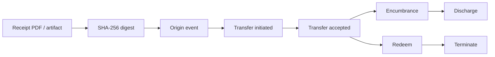

# Control Actions

The MLWR Control Desk uses warehouse receipt language, but each action maps to a general OpenETR control event.

## Action Map

| Domain Action | OpenETR Action | Purpose |
| --- | --- | --- |
| Issue receipt | origin event | Create the first signed record for the receipt digest. |
| Transfer receipt | `transfer_initiate` and `transfer_accept` | Move control from one holder/controller to another. |
| Record pledge or lien | `encumber` | Record a control-relevant restriction, pledge, lien, or secured-party interest. |
| Release pledge or lien | `discharge` | Discharge a specific encumbrance event. |
| Present for delivery | `redeem` | Record presentation or demand for delivery. |
| Complete delivery | `terminate` | Mark the receipt lifecycle complete. |

## Control Graph

Each control event refers to the same receipt object through the `o` tag.

Events can also link to prior events through the `e` tag. This makes the control chain inspectable and cryptographically verifiable.

## Effect Is Policy-Dependent

OpenETR can show that an event was signed, linked, retrievable, and structurally valid.

Legal or business effect is determined by a verifier policy or recognition framework. A generic verifier should warn when a transition appears inconsistent with its rule book, but should not erase the event or pretend the signature does not exist.

## Source Notes

- [OpenETR Generic Transfer Model](https://github.com/trbouma/openetr/blob/main/docs/specs/OPENETR_GENERIC_TRANSFER_MODEL.md)
- [OpenETR Generic Verifier Policy](https://github.com/trbouma/openetr/blob/main/docs/specs/OPENETR_GENERIC_VERIFIER_POLICY.md)
- [Control Event Minimum Shapes](https://github.com/trbouma/openetr/blob/main/docs/specs/CONTROL_EVENT_MINIMUM_SHAPES.md)

