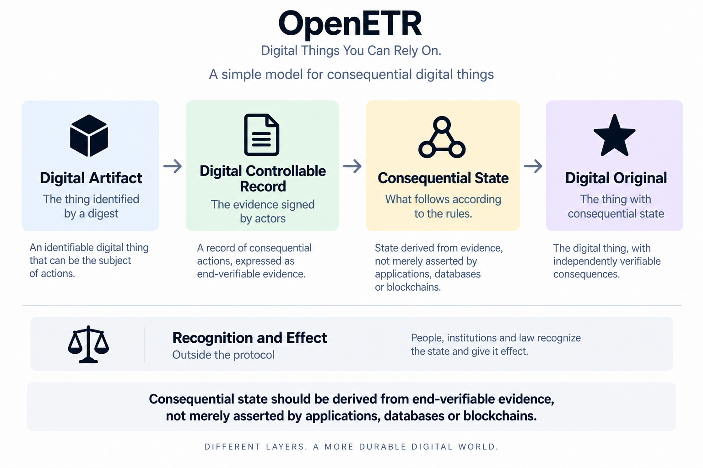

# OpenETR

## Digital Things You Can Rely On

OpenETR provides a simple protocol model for digital things people need to rely
on. It separates the thing itself, the evidence of actions concerning it, and
the state that follows from those actions under defined rules.

For example, the digital thing might be a government-issued document, an
electronic trade document, or a digitized cultural artifact. OpenETR can
establish it as a Digital Original that can be independently verified, while
the relevant authority, institution, or law determines whether the digital
thing should be recognized and what real-world effect it should have.

## Three Primitives. One Core Concept.

The OpenETR model is deliberately simple. The diagram below shows how three
primitives and one core concept fit together, with recognition and effect
remaining outside the protocol.

<figure class="openetr-model-figure openetr-model-figure--marquee">
  
  <figcaption>
    Recognition and effect remain outside the protocol.
  </figcaption>
</figure>

## The Problem And The Insight

The central insight is that the problem is not how to prevent copies. Digital
content can be copied perfectly, and that is often useful. The harder problem
is determining what constitutes the Digital Original and what verifiable
evidence establishes its consequential state.

The file alone cannot tell us who made a consequential statement about it,
what has happened to it, or which state should now be relied upon.

This matters for warehouse receipts, bills of lading, permits, certificates,
product passports, health records, photographs, and many other records that
people and institutions act upon.

OpenETR addresses the problem without making one application, database,
registry, or wallet the permanent source of truth. It identifies the exact
content, preserves end-verifiable evidence concerning it, and applies defined
protocol rules so another conforming system can derive the same state.

Applications may maintain projections of consequential state, but those
projections are not the authority. Applications derive consequential state;
they do not own it.

## Four Questions

These questions extend, in spirit, the [Law Commission of England and Wales's
recognition](https://lawcom.gov.uk/project/digital-assets/) that some digital
assets may exist beyond the traditional personal-property categories of things
in possession and things in action. The [Property (Digital Assets etc) Act
2025](https://www.legislation.gov.uk/ukpga/2025/29) now confirms that a digital
or electronic thing is not excluded from personal-property rights merely
because it is neither. In that spirit, OpenETR uses **digital things** as a
broader protocol description, not as the legal name of the third category or a
claim that every Digital Artifact is property.

**What is the digital thing?** The **Digital Artifact**, identified by a digest.

**What happened concerning it?** The **Digital Controllable Record**, containing
evidence signed by actors.

**What follows?** **Consequential State**, derived according to defined rules.

**What has the digital thing become?** A **Digital Original**, the thing with
consequential state.

The final question sits outside the protocol: **so what?** People,
institutions, systems, and law recognize consequential state and determine what
effect it receives.

> Consequential state should be derived from end-verifiable evidence, not
> merely asserted by applications, databases or blockchains.

## Three Primitives And One Core Concept

### Digital Artifact

The **Digital Artifact** is persistent digital content with a unique content
identity, normally established by a cryptographic digest. It may be a document,
image, credential, record, data structure, or other identifiable content. It is
the subject of consequential actions.

### Digital Controllable Record

The **Digital Controllable Record (DCR)** is a single end-verifiable record or a
graph of related end-verifiable records containing evidence of consequential
actions concerning a Digital Artifact. It may contain an Anchor and later
records such as transfer, encumbrance, discharge, relinquishment, attestation,
redemption, or termination.

The DCR is not the file. It is the portable record of consequential statements
made about the file.

### Consequential State

**Consequential State** is state that follows from consequential actions
according to defined protocol rules. It is not another record or container and
it is not “the validation.” Validation asks whether evidence is authentic,
intact, authorized, and acceptable under the protocol. Consequential State is
what follows when the relevant evidence is evaluated according to the rules.

For example, the resulting state may identify a controller, show that an
artifact is active or encumbered, identify a secured party, or show that its
lifecycle has ended.

> Cryptography validates the evidence. Protocol rules determine what follows.

### Digital Original

A **Digital Original** is a Digital Artifact for which consequential state has
been established through a Digital Controllable Record.

Originality does not belong to one physical copy. Identical copies represent
the same artifact and can be checked against the same DCR and state.

> A copy can reproduce the content. It cannot independently reproduce the
> consequential state.

The complete path is:

```text
Digital Artifact -> Digital Controllable Record -> Consequential State -> Digital Original

Consequential State -> Recognition -> Effect
```

## A Simple Example

A warehouse issues a PDF receipt for stored grain. Its fingerprint identifies
the Digital Artifact. The warehouse signs an Anchor record, and a later signed
record transfers control to a buyer. Those records form the candidate DCR.
Cryptography validates the evidence, and OpenETR rules derive the candidate
current-controller state.

Emailing another copy of the PDF does not transfer the receipt. Editing the PDF
creates a different artifact. Changing its consequential state requires valid
signed evidence.

A bank, registry, court, or trading partner then decides whether to recognize
the signers and resulting state. OpenETR preserves the evidence and derives
protocol state; it does not claim that cryptography alone creates ownership or
other legal or commercial effect.

## Start Here

| Area | Purpose |
| --- | --- |
| [The Core Model](policy-briefs/digital-artifact-dcr-digital-original.md) | Read how Digital Artifacts, DCR evidence, protocol rules, consequential state, and Digital Originals fit together. |
| [Digital Originality](policy-briefs/digital-originality.md) | Explore consequential state and the model through detailed examples. |
| [OpenETR Overview](openetr/index.md) | Continue into the architecture, wire format, implementation surfaces, and recognition boundary. |
| [Warehouse Receipts](getting-started.md) | Work with warehouse receipt documents using MLWR-style terminology over OpenETR DCR evidence and state transition rules. |
| [Product Passports](product-passports.md) | Start modelling Product Passport control records for product data, compliance evidence, and lifecycle attestations. |
| [Health Records](health-records.md) | Placeholder for future health-record control graph workflows, with privacy and consent concerns called out early. |
| [Apostille Documents](apostille-documents.md) | Placeholder for future apostille and legalization document verification workflows. |

## Live App

| Page | Purpose |
| --- | --- |
| [`https://openetr.org/`](https://openetr.org/) | OpenETR Control Desk app with query-only upload flow |
| [`https://openetr.org/warehouse-receipts`](https://openetr.org/warehouse-receipts) | Warehouse Receipts workspace |
| [`https://openetr.org/digital-product-passports`](https://openetr.org/digital-product-passports) | Product Passports workspace |
| [`https://openetr.org/openetr`](https://openetr.org/openetr) | Advanced OpenETR console |
| [`https://openetr.org/docs`](https://openetr.org/docs) | FastAPI-generated API docs |

## Core Vocabulary

| Term | Meaning |
| --- | --- |
| Digital Artifact | Persistent digital content with a unique content identity, normally established by a cryptographic digest. |
| Digital Controllable Record | A single end-verifiable record or graph of related end-verifiable records containing evidence of consequential actions concerning a Digital Artifact. |
| Consequential State | State that follows from consequential actions according to defined protocol rules. |
| Control Record | A signed OpenETR lifecycle record within a DCR. |
| Linked Evidence Record | A signed record that associates another document, artifact, or evidence item with a Digital Artifact without necessarily transferring control. |
| Control Graph | The linked control-event portion of a DCR. |
| Evidence Graph | The broader DCR graph, including Anchor, control, and linked-evidence records. |
| Digital Original | A Digital Artifact for which consequential state has been established through a Digital Controllable Record. |
| Domain Workspace | A user-facing adapter that speaks domain language while using the same OpenETR DCR evidence and state transition rules underneath. |
| Recognition Layer | Law, registry policy, institutional rules, verifier policy, or contracts that decide whether consequential state is accepted and what effect it receives. |

## Core Thesis

OpenETR does not try to become each domain's system of record, registry, legal authority, or compliance engine.

Instead, it preserves durable evidence from which consequential state can be
derived:

```text
real-world object, product, document, or record
  -> canonical file or data artifact
  -> Digital Artifact identified by digest
  -> Digital Controllable Record containing an Anchor and later records
  -> evidence is validated and protocol rules derive consequential state
  -> Digital Original
  -> durable query link and QR code
  -> verifier / registry / authority / relying party decides effect
```

The artifact content can stay with the operator, manufacturer, registry,
platform, or storage service. OpenETR preserves its cryptographic identity and
portable DCR evidence.

OpenETR does not decide universal effect. It preserves durable signed evidence
and derives consequential state according to defined protocol rules.
Recognition outside the protocol determines what legal, institutional,
commercial, or operational effect that state receives.

## Documentation Tracks

| Track | Audience | Starting Point |
| --- | --- | --- |
| OpenETR | Implementers, protocol reviewers, system integrators | [OpenETR Overview](openetr/index.md) |
| Warehouse Receipts | Warehouse operators, MLWR reviewers, domain integrators | [Warehouse Receipts Overview](getting-started.md) |
| Product Passports | Product, compliance, lifecycle, and supply-chain integrators | [Product Passports Overview](product-passports.md) |
| Health Records | Health data, consent, privacy, and clinical workflow integrators | [Health Records Overview](health-records.md) |
| Apostille Documents | Notarial, legalization, authority, and document verification integrators | [Apostille Documents Overview](apostille-documents.md) |

## Source Specifications

Key source documents:

- [GitHub repository](https://github.com/trbouma/openetr)
- [Specification index](https://github.com/trbouma/openetr/blob/main/docs/specs/INDEX.md)
- [OpenETR Layered Architecture Note](https://github.com/trbouma/openetr/blob/main/docs/specs/OPENETR_LAYERED_ARCHITECTURE_NOTE.md)
- [OpenETR Nostr Wire Format](https://github.com/trbouma/openetr/blob/main/docs/specs/OPENETR_NOSTR_WIRE_FORMAT_SPEC.md)
- [OpenETR MLWR Profile](https://github.com/trbouma/openetr/blob/main/docs/specs/OPENETR_MLWR_PROFILE.md)
- [MLWR Article Requirements Mapping](https://github.com/trbouma/openetr/blob/main/docs/specs/MLWR_ARTICLE_REQUIREMENTS_MAPPING.md)
- [Digital Product Passport Requirements Mapping](https://github.com/trbouma/openetr/blob/main/docs/specs/DIGITAL_PRODUCT_PASSPORT_REQUIREMENTS_MAPPING.md)
