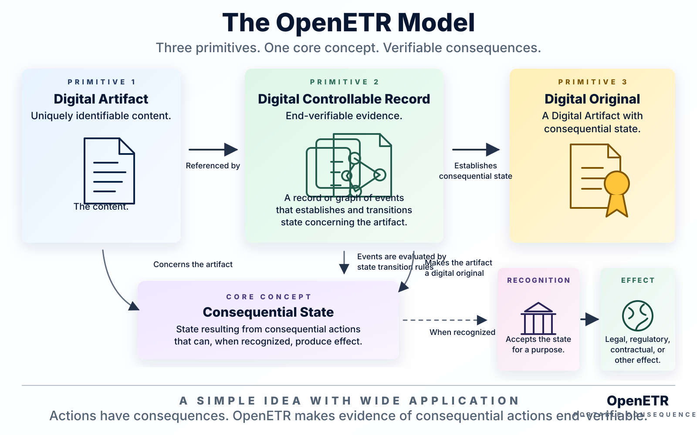

# OpenETR Overview

OpenETR is a protocol for deriving consequential state from end-verifiable
evidence concerning durable electronic records.

If this is your first encounter with OpenETR, start with one practical
question: **how can another party determine what happened to a digital record
without having to trust the application displaying it?** OpenETR answers by
keeping the identifiable content, the signed evidence, the derived state, and
external recognition separate.



It is not limited to warehouse receipts. The Warehouse Receipts workspace is the first focused domain adapter, and the Product Passports workspace is the next domain surface. The underlying OpenETR model is intended to support Digital Artifacts such as bills of lading, certificates, credentials, secured finance records, product data artifacts, and other electronic transferable records.

The model can be read from left to right:

```text
identifiable content
  -> signed evidence concerning it
  -> DCR evaluated by state transition rules
  -> consequential state
  -> recognition and practical effect
```

OpenETR calls the identifiable content a **Digital Artifact**. It calls the
signed evidence a **Digital Controllable Record (DCR)**. A DCR may be one
independently verifiable signed record or a graph of related records spanning
the evidenced lifecycle. Consequential state is the result of validating that
DCR under an applicable policy and applying defined state transition rules. A
Digital Artifact with established consequential state is a **Digital
Original**.

The DCR is not the file, and the word “controllable” does not automatically
give it legal status. Legal recognition remains a separate question.

For a complete worked example, see the [English Gutenberg reconstruction in
the Digital Originality
brief](../policy-briefs/digital-originality.md#concrete-example-an-english-gutenberg-reconstruction).

## Layered Model

```text
Domain adapter         Warehouse Receipts, Product Passports, bills of lading, credentials
OpenETR control layer  DCR evidence, state transition rules, consequential state
Nostr wire format      signed events, kinds, tags, relays, event ids
Recognition layer      law, contracts, registry rules, institutional policy
```

OpenETR sits in the middle. It turns domain actions, document identities, control assertions, and evidence links into signed protocol evidence without forcing every domain to share the same user interface, vocabulary, statute, or business process.

## What OpenETR Provides

OpenETR defines:

- digest-addressed Digital Artifacts;
- Digital Controllable Records made of signed end-verifiable events;
- state transition rules for deriving state from DCR evidence;
- Anchor records that begin candidate DCRs;
- control events for transfer, encumbrance, discharge, redemption, termination, and attestation;
- linked evidence records for supporting documents and lifecycle evidence;
- profile-backed signing;
- object-centric relay queries;
- control graph traversal;
- verifier policy warnings;
- CLI, JSON, Python component, and webapp integration surfaces.

## What OpenETR Does Not Decide

OpenETR does not, by itself, decide:

- legal title;
- protected-holder status;
- warehouse licensing;
- KYC status;
- registry recognition;
- statutory effect;
- priority among competing claims.

Those are recognition questions. OpenETR's control layer preserves durable
signed evidence and derives consequential state that a recognition layer can
evaluate.

## Source Specs

- [Controllable Records Taxonomy](https://github.com/trbouma/openetr/blob/main/docs/specs/CONTROLLABLE_RECORDS_TAXONOMY.md)
- [Digital Controllable Record](https://github.com/trbouma/openetr/blob/main/docs/specs/DIGITAL_CONTROLLABLE_RECORD_DESIGN_NOTE.md)
- [OpenETR Layered Architecture Note](https://github.com/trbouma/openetr/blob/main/docs/specs/OPENETR_LAYERED_ARCHITECTURE_NOTE.md)
- [OpenETR Generic Transfer Model](https://github.com/trbouma/openetr/blob/main/docs/specs/OPENETR_GENERIC_TRANSFER_MODEL.md)
- [OpenETR Generic Verifier Policy](https://github.com/trbouma/openetr/blob/main/docs/specs/OPENETR_GENERIC_VERIFIER_POLICY.md)
