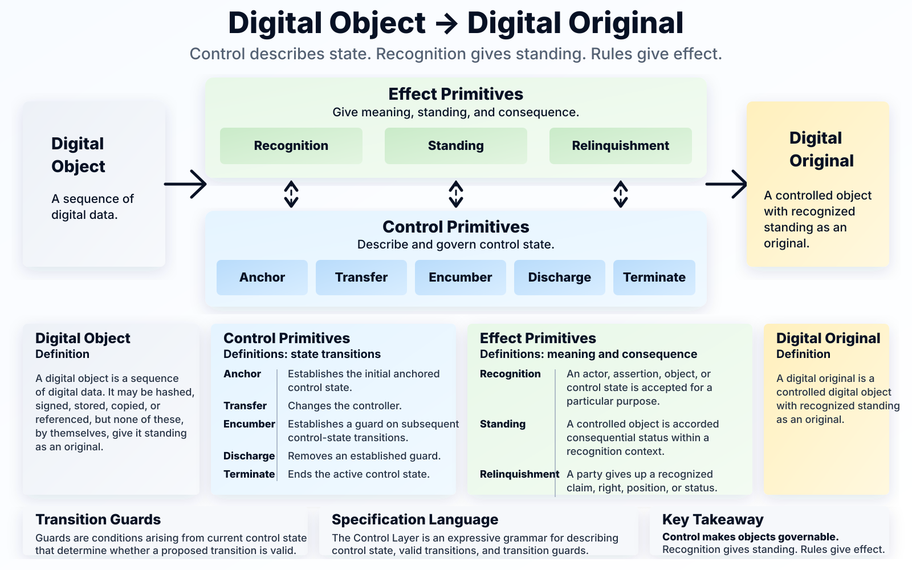

# Digital Originality

## The Problem

Digital systems make copying effortless. A scanned licence, a PDF certificate, a warehouse receipt file, or a digital form can be duplicated perfectly. That creates a difficult question for law, trade, archives, public administration, and community records:

> What does it mean for something to be an original when copies are indistinguishable?

The answer cannot be that the bytes are unique. They are not. Nor can the answer be only that a file was hashed, signed, timestamped, or stored. Those techniques are useful, but they do not by themselves make a record the operative original.

The key distinction is:

> Digital originality is about standing, not copying.

## The Core Insight

A Digital Original can be understood as:

> A controlled digital object with recognized standing as an original.



That definition separates three things that are often blended together:

| Question | Concept |
| --- | --- |
| What data exists? | Digital object |
| Who can act on it, and under what rules? | Control |
| Is it recognized as the original for this purpose? | Standing |

This is the point that becomes obvious once stated, but is easy to miss when digital-original discussions begin with files, wallets, ledgers, signatures, or timestamps.

## What OpenETR Contributes

OpenETR provides a control layer for digital objects. It can describe and verify control events such as anchoring, transfer, encumbrance, discharge, and termination.

That control layer is important because it makes a digital object governable. It can answer questions such as:

- Which object is being controlled?
- Who currently controls it?
- How did control move?
- Are there guards on further transfer?
- Has the object been discharged or terminated?

But OpenETR does not by itself decide whether the object has legal or institutional standing as an original. That depends on recognition by the relevant authority, institution, contract, community, verifier policy, or legal regime.

In short:

> Control makes actions possible. Standing makes them consequential.

## What OpenETR Does Not Do

OpenETR should not be treated as a magic originality machine.

It does not perform KYC. It does not decide who is a legally competent issuer. It does not determine whether a warehouse operator, public agency, archive, community body, or company has authority for a particular purpose. It does not replace a reliable system where law or policy requires one.

Instead, OpenETR gives those systems a common way to express signed control events and control graphs across institutional boundaries.

## A Simple Example

A physical driver's licence can be scanned. The scan can be hashed, signed, timestamped, and anchored. Those steps can help prove that a particular scan existed and has not changed.

But the scan is still only a digital object unless it is placed under control and recognized by the relevant licensing authority or recognition regime.

The path looks like this:

```text
Physical licence
  -> Scan
  -> Digital object
  -> Controlled digital object
  -> Recognition
  -> Digital Original standing
```

The same pattern can apply to warehouse receipts, bills of lading, apostille documents, product passports, permits, certificates, corporate records, community records, and archives.

## Recognition Is Contextual

Recognition is not a universal yes-or-no property. It is contextual.

A verifier may recognize one issuer for warehouse receipts, another for driver licences, another for apostille documents, and another for community records. A single file or digest may even have multiple anchors, with different relying parties recognizing different authorities for different purposes.

This is why OpenETR separates protocol validity from recognized standing.

A control graph may be cryptographically valid. That does not automatically mean the controlled object is legally effective, institutionally authoritative, or accepted by a relying party.

## Why This Matters For Policy

Policy discussions about digital records often focus on technology: wallets, signatures, chains, registries, identifiers, credentials, or timestamps. Those tools matter, but they answer only part of the problem.

Good policy should ask:

- What object is being controlled?
- Who is recognized as authoritative for this purpose?
- What standing is the object given?
- What consequences follow from that standing?
- What happens when control is transferred, encumbered, discharged, surrendered, or terminated?

This keeps the technical layer honest and the legal layer visible.

## Surrender And Relinquishment

The idea of surrender is especially important for transferable records.

In a commercial setting, surrender can be positive. A party may surrender control of a record after payment, delivery, or discharge of an obligation.

In other settings, surrender can be concerning. A person may be required to surrender a passport or other credential to an authority, with the possibility of revocation or loss of practical freedom.

OpenETR can record the control events around surrender, such as transfer to an authority or termination of an active control state. But the meaning of surrender belongs to the recognition and effect layer. More generally, surrender is a form of relinquishment: giving up a recognized claim, right, position, or control-related status.

## Bottom Line

OpenETR is not trying to declare every anchored file an original. It is a way to express control over digital objects so that legal, institutional, contractual, and community systems can decide what standing and effect to give them.

That is the core design move:

```text
Digital object + control + recognition = possible Digital Original
```

The policy opportunity is to stop treating originality as a property of a file and start treating it as recognized standing attached to a controlled digital object.

## Related Design Note

For the detailed model, see the [Digital Originality, Control, And Standing Design Note](https://github.com/trbouma/openetr/blob/main/docs/specs/DIGITAL_ORIGINALITY_CONTROL_AND_STANDING_DESIGN_NOTE.md).
