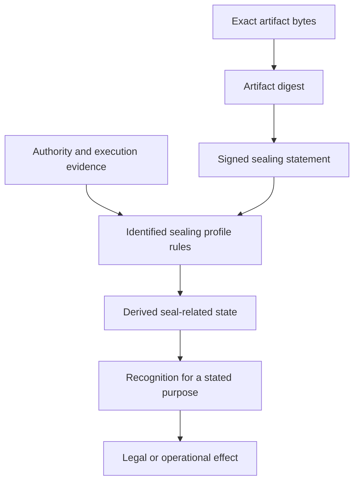

# Electronic Seals And OpenETR

An electronic seal should let a relying party establish which record was
sealed, who stands behind the sealing statement, what that statement means,
and whether it should be recognized for the intended use.

**OpenETR could provide the durable evidence foundation for electronic seals.**
Its contribution is to bind an explicit statement to an exact Digital Artifact,
preserve evidence of authority and subsequent events, and support independent
verification under defined rules. Legal seal status and effect remain matters
for the applicable regime and recognition policy.

This brief proposes a direction for a sealing profile. The current base
ruleset provides anchoring and publisher-position evidence, not a complete
electronic-seal service or a claim of statutory compliance.

## What The Article Contributes

John Gregory's [Electronic Seals](https://www.slaw.ca/2011/10/28/electronic-seals/),
published in Slaw on 28 October 2011, examines transactional seals and the
difficulty of translating their functions into electronic practice. He
distinguishes deliberate execution under seal from ordinary signing and
corporate identification. Intention and the legal consequences sought matter;
adding a familiar visual mark does not resolve those questions.

The article is a historical discussion, not a current jurisdiction-by-jurisdiction
guide. Its enduring architectural lesson is to identify the function a seal
must perform before selecting its electronic representation.

## Different Seal Functions Need Different Evidence

Gregory's companion article,
[Electronic Seals: The Public Sector](https://www.slaw.ca/2011/12/23/apostille-convention/)
(23 December 2011), connects public authentication to secure electronic
records and official verification references. The updated
[Apostille brief](apostille-records-need-consequential-state.md) develops this
connection, including treaty obligations and paper-to-digital verification.

For an OpenETR profile, the useful starting point is a set of distinct claims:

| Function sought | What OpenETR could contribute | What needs separate establishment |
| --- | --- | --- |
| Integrity of an identified record | Digest comparison and a signed statement bound to those bytes | The accuracy or legal sufficiency of the contents |
| Organizational origin | Key attribution plus linked organizational evidence | Recognition of the key as acting for that organization |
| Approval or certification | Explicit purpose, scope, and authority references | The signer's mandate and the substantive standard applied |
| Deliberate execution under seal | A signed declaration of intent and evidence of the execution process | Applicable formalities and legal effect |
| Confidential handling | Evidence exchange without routine publication of the artifact | Encryption, access controls, and retention policy |

These claims should not be collapsed into a single badge saying "sealed."
A document may have verified integrity while its issuer's authority remains
unresolved. An organization may authenticate origin without promising that
every statement in the document is correct.

## The Proof Is Outside The Artifact

OpenETR identifies the Digital Artifact by its exact bytes using a digest.
Separate signed records form its Digital Controllable Record (DCR). A sealing
profile could bind an explicit declaration to that digest and link the
authority evidence needed to evaluate it.

This supports PDFs, images, structured records, and other formats without
requiring every format to carry OpenETR metadata. A logo or seal graphic may
help presentation, but the verifiable evidence supplies the technical basis.

The statement should specify the seal's purpose, the principal and signing
capacity, the exact declaration adopted, the applicable profile, and relevant
evidence references. A generic Anchor Event establishes that a key anchored
the artifact. It does not establish those additional claims by implication.

If a visible seal or embedded signature changes a file, the result has a new
byte identity. The workflow must identify the final bytes or explicitly link
the different representations. A QR code can retrieve seal evidence, but
scanning it does not verify that a printed page matches the original bytes.

## Authority And Intention Must Be Expressed

For an organizational-origin seal, a verifier needs evidence connecting the
signing key to the organization and its permitted role. A self-declared
profile name is insufficient. Certificates, organizational attestations,
mandates, or recognized registry information can support that connection,
according to the relying party's policy.

For deliberate execution under seal, the workflow should make the proposed
act explicit and preserve evidence that the declaration was adopted for the
identified document. Required witnessing, delivery, capacity, and other
formalities need their own treatment in a jurisdiction-specific profile.
OpenETR cannot infer conscious intention merely because software produced a
valid signature.

Actor-neutrality remains useful here. An authorized service might apply an
organizational-origin seal automatically, while another profile requires an
identified person's approval. The protocol can carry evidence from either
workflow; the rulebook determines what is sufficient.

## Recognition Is Regime-Specific

Two examples illustrate why cryptographic verification must remain separate
from legal seal classification.

In the Canadian federal context, PIPEDA section 39 provides a seal-equivalence
route for covered federal provisions listed in Schedule 2 or 3, using a secure
electronic signature identified as the person's seal. It is not blanket
recognition for all electronically signed documents.
[PIPEDA, section 39](https://laws-lois.justice.gc.ca/eng/acts/P-8.6/section-39.html).
The prescribed process includes certificate validation requirements; an
OpenETR signature alone does not establish compliance.
[Secure Electronic Signature Regulations, sections 2-4](https://lois.justice.gc.ca/eng/regulations/SOR-2005-30/page-1.html).

Under EU eIDAS, an electronic seal concerns origin and integrity and its
creator is a legal person. A qualified seal requires a qualified certificate
and qualified creation device. Article 35 provides a presumption of integrity
and correctness of origin for qualified seals. That category should not be
confused with common-law execution of a deed.
[eIDAS, Articles 3 and 35](https://eur-lex.europa.eu/legal-content/en/TXT/?uri=CELEX%3A02014R0910-20241018).

OpenETR could complement a regulated seal provider by preserving the artifact
binding, supporting validation material, and later evidence. It does not
become a qualified provider or create a qualified seal simply by recording a
signature. An integration must also distinguish a seal over the artifact from
a seal over a separate report about it.

## Sealing And Control Are Distinct

A warehouse might seal a receipt to attest that it originated from the
warehouse. Control of that receipt may subsequently transfer to another
participant. The warehouse remains the source of its sealing statement;
the new controller does not become the seal issuer.

This is where OpenETR's control layer adds value alongside seal evidence.
The graph can preserve origin, later control events, and subsequent notices
as distinct evidence evaluated under the appropriate rules. A seal alone does
not establish a current controller, and a transfer does not erase origin.

Similarly, withdrawing support for a document does not automatically rescind
a transaction or invalidate earlier reliance. The withdrawal is another
attributable statement whose consequence depends on the relevant rules.
Core Publisher Notices preserve this distinction, but they do not implement
every seal lifecycle or key-recovery scenario.

## Verification That Can Outlast The Service

A durable seal workflow should preserve the signed declaration, artifact
digest, authority evidence, applicable rules, and any required time or
certificate-status evidence. Historical authority should not depend solely
on what a registry says today. Signer-declared timestamps are not independent
proof of when sealing occurred.

The verifier should report artifact correspondence, signature validity,
authority, sealing purpose, later notices, evidence gaps, and recognition
separately. No withdrawal found is not proof that none exists. Conflicting
statements and compromised-key evidence need explicit treatment.

The underlying document need not be publicly available. Authorized evidence
exchange and proportionate disclosure remain possible, although public
digests and metadata can expose associations. Future privacy-preserving
profiles could reduce disclosure of supporting authority evidence without
removing the need for an independently checkable basis.

## A Practical Starting Point

The first profile should address a bounded organizational-origin use case,
such as a warehouse issuing a receipt or an institution publishing a
certificate. It should specify the declaration, authority evidence, key
management, status rules, and verification bundle before adding a "seal"
button to an application.

Deed execution and regulated qualified-seal integration should receive their
own profiles. This keeps the promised function clear: OpenETR supplies durable,
verifiable evidence of a sealing act, while the applicable rulebook determines
the consequence and recognition it receives.

## Design Basis And Related Reading

- [Electronic Seals Design Note](https://github.com/trbouma/openetr/blob/main/docs/specs/ELECTRONIC_SEALS_DESIGN_NOTE.md)
- [Core Record Ruleset 1.0](https://github.com/trbouma/openetr/blob/main/docs/specs/OPENETR_CORE_RECORD_RULESET_1_0.md)
- [Organizational Reference Layer](https://github.com/trbouma/openetr/blob/main/docs/specs/OPENETR_ORGANIZATIONAL_REFERENCE_LAYER_DESIGN_NOTE.md)
- [Actor-Neutral Identity](https://github.com/trbouma/openetr/blob/main/docs/specs/OPENETR_ACTOR_NEUTRAL_IDENTITY_DESIGN_NOTE.md)
- [Why Control Is Not Recognition](why-control-is-not-recognition.md)
- [Apostille Records Need Consequential State](apostille-records-need-consequential-state.md)
- [Independent Verification Without Full Disclosure](independent-verification-without-full-disclosure.md)
