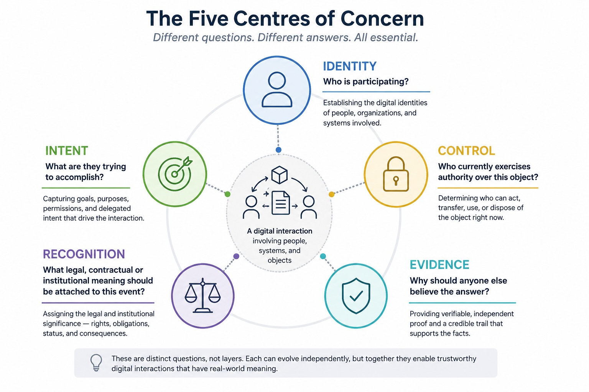

# The Five Centres Of Concern And OpenETR

Digital trust debates often become confused because different people are trying to answer different questions with the same architecture.

The Substack essay [The Niels Bohr Moment for Digital](https://trbouma.substack.com/p/the-niels-bohr-moment-for-digital?r=3r59) frames this problem through five distinct centres of concern:

- identity;
- intent;
- control;
- evidence;
- recognition.

Those are not merely implementation layers. They are different questions. Each has its own tools, institutions, failure modes, and policy logic.



## The Bohr Moment

The essay's historical analogy is Niels Bohr's first model of the atom.

Bohr's atom was not the final theory. It was incomplete and later replaced by quantum mechanics. But it mattered because it gave physicists a new vocabulary: stable energy levels, quantized transitions, atomic states. It made uncomfortable observations easier to organize before the deeper theory arrived.

The argument is that digital architecture may be in a similar moment.

The old vocabulary still matters:

- users;
- applications;
- databases;
- files;
- APIs;
- protocols;
- identity;
- authentication;
- authorization.

But digital systems are increasingly doing more than moving information. AI agents negotiate, organizations delegate authority to software, electronic records replace paper documents, digital assets behave like property, and legal rights are represented entirely electronically.

That shift exposes questions that the older vocabulary was not designed to keep separate.

OpenETR fits this moment because it does not claim to be the final architecture. It offers a sharper vocabulary for one family of concerns: Digital Artifacts, Digital Controllable Records, consequential state, linked evidence, and recognition context.

## The Core Insight

A trustworthy digital interaction is not solved by one answer.

It requires several answers that can be evaluated independently:

| Centre | Question |
| --- | --- |
| Identity | Who is participating? |
| Intent | What are they trying to accomplish? |
| Control | Who currently exercises authority over this object? |
| Evidence | Why should anyone else believe the answer? |
| Recognition | What legal, contractual, or institutional meaning should be attached to this event? |

The policy mistake is to collapse these questions into one system.

A digital identity wallet may answer identity well, but it does not necessarily answer object control. A registry may answer recognition inside its own rulebook, but it may not preserve portable evidence outside that registry. A smart contract may enforce a state transition, but it may not prove legal authority, human intent, or institutional recognition.

The five-centres model makes room for a more careful architecture.

It asks a better diagnostic question:

```text
What concern is this technology actually trying to address?
```

That is different from asking where a technology fits in a stack.

A technology may be strong at identity and weak at evidence. Another may be
strong at recognition inside one rulebook and weak at portability. Another may
provide reliable DCR evidence and policy validation while intentionally leaving
identity recognition and legal effect to other systems.

This distinction helps explain why apparently competing standards may actually be illuminating different parts of the same problem.

## A Future Transaction

The article imagines an ordinary future transaction:

- an AI purchasing agent negotiates shipment of industrial equipment;
- another AI agent verifies export controls;
- a logistics provider issues an electronic bill of lading;
- a financing bank takes a security interest;
- a customs authority approves the shipment;
- every step happens digitally.

That scenario immediately raises the five questions:

| Concern | Future-transaction question |
| --- | --- |
| Identity | Who are the people, organizations, systems, and agents participating? |
| Intent | What has each actor or agent been authorized to accomplish? |
| Control | What control state can be derived for the electronic bill of lading or related Digital Artifact? |
| Evidence | What will convince a court, auditor, bank, customs authority, or trading partner later? |
| Recognition | What legal, contractual, regulatory, or institutional consequence follows from each event? |

Trying to answer all of those questions with only an account system, OAuth-style authorization, a database, and an audit log is conceptually thin.

Those tools may still be useful.

They are not the whole vocabulary.

## OpenETR's Place In The Model

OpenETR is primarily concerned with **evidence** and the derivation of
**Consequential State**, including control state.

It asks:

```text
What is the Digital Artifact and which DCR concerns it?
What signed events exist for that object?
Who signed them?
How do they link?
What candidate control state can be derived?
What evidence can a verifier inspect later?
```

OpenETR does not try to be the whole digital trust stack.

It does not replace identity wallets, registries, trust frameworks, competent authorities, legal rulebooks, enterprise account systems, or domain platforms.

Instead, it supplies a connective evidence and state-derivation model: Digital Artifact digests,
signed DCR evidence, linked evidence, derived state, and verifier outputs that
can be used by other systems.

That is exactly why OpenETR should remain narrow.

It should not absorb identity, intent, and recognition into itself just because
they are adjacent concerns. The five centres remain lines of inquiry, not five
required OpenETR protocol layers. OpenETR should make the evidence and
state-derivation questions clearer, then allow other systems to answer the
other questions with their own appropriate methods.

## Mapping The Five Centres To OpenETR

| Centre | OpenETR relationship |
| --- | --- |
| Identity | OpenETR profile keys sign events. Profiles may be linked to NIP-05 identifiers, published profiles, known entities, credentials, registries, or trust-framework signals. OpenETR can show which key signed, but external policy decides whether that identity is recognized. |
| Intent | OpenETR events can carry actions, tags, comments, references, and domain metadata that express what the signer intended to do. Domain adapters and workflow systems provide the user-facing intent capture. |
| Control | OpenETR derives candidate controller and lifecycle state from validated DCR evidence concerning a digest-identified Digital Artifact. Control records form the Control Graph within the broader Evidence Graph. |
| Evidence | OpenETR creates cryptographically self-contained signed events. Event ids, signatures, object digests, graph links, relay results, and linked evidence records can be independently inspected. |
| Recognition | OpenETR does not decide final effect. Laws, contracts, registries, courts, competent authorities, trust frameworks, verifier policies, and relying parties decide what the evidence means. |

This mapping keeps OpenETR disciplined.

It can be very strong at control and evidence without pretending to answer every identity, intent, or recognition question by itself.

## Artifact, DCR, State, And Recognition

The five-centres model also clarifies why OpenETR keeps content, evidence,
state, and recognition separate.

In OpenETR:

```text
Digital Artifact -> Digital Controllable Record -> consequential state
consequential state -> recognition -> effect
```

The **Digital Artifact** is the persistent content: a document, file, Product
Passport, warehouse receipt, credential, certificate, registry export, data
bundle, or other digest-addressed record. A **Digital Controllable Record** is
the signed record or graph concerning that artifact. Its presence does not, by
itself, assert derived consequential state or a current controller.

The DCR graph is the signed event history concerning the artifact. Validation
checks that evidence, and protocol rules derive consequential state. That is
what makes the Digital Artifact a Digital Original.

The **Recognition Context** is the legal, institutional, contractual, registry, or verifier-policy setting that decides effect.

The five centres help show why those pieces should not be collapsed:

- identity asks who is acting;
- intent asks what they are trying to do;
- control asks who can act on the object now;
- evidence asks what can be independently verified;
- recognition asks what consequence follows.

An electronic transferable record is one important application of the model.
Product Passports, health records, Apostille documents, credentials, linked
evidence records, and authority-recognized records can also fit the broader
pattern without being treated as legally transferable instruments.

## Why OpenETR Should Stay Behind The Scenes

The five-centres model reinforces why OpenETR should not try to become a replacement platform.

Existing systems may already handle parts of the model well:

- enterprise systems may handle identity and intent;
- document platforms may handle storage and workflow;
- registries may handle recognition;
- wallets may handle credentials and presentation;
- courts, regulators, and authorities may handle legal effect.

OpenETR can work underneath those systems.

It can generate content-derived object identifiers and preserve signed DCR
events that survive outside any one application database. Those events can be
stored on relays, in archives, in registries, in local files, in private
databases, or in other repositories.

The goal is not to force everyone into one OpenETR application.

The goal is to let many systems produce and consume the same kind of portable
DCR evidence.

## Policy Implication

Policymakers should avoid one-centre architectures.

Digital identity is not enough by itself.

Registries are not enough by themselves.

Credentials are not enough by themselves.

Smart contracts are not enough by themselves.

Each can be useful, but each answers only part of the larger digital trust problem.

OpenETR's policy value is that it gives artifact-centric evidence and
Consequential State a clean, inspectable form. That makes it easier for
identity systems, intent-capture workflows, registries, competent authorities,
trust frameworks, and relying parties to do their own jobs without needing one
platform to answer every question.

This is also why OpenETR should not be presented as the one protocol that will win.

The better policy claim is more modest:

```text
OpenETR names and implements the control/evidence concern for durable controllable records.
```

That contribution can complement DNS-based identity work, agent authorization frameworks, verifiable credentials, trust registries, transparency logs, electronic transferable record systems, and domain registries.

The point is not convergence on a single platform.

The point is clearer separation of concerns.

The right architecture is not:

```text
One system decides everything.
```

It is:

```text
Different questions.
Different answers.
Cryptographic evidence connecting them.
Recognition by accountable rulebooks.
```

## Source Specifications

- [The Niels Bohr Moment for Digital](https://trbouma.substack.com/p/the-niels-bohr-moment-for-digital?r=3r59)
- [Controllable Records Taxonomy](https://github.com/trbouma/openetr/blob/main/docs/specs/CONTROLLABLE_RECORDS_TAXONOMY.md)
- [OpenETR Layered Architecture Note](https://github.com/trbouma/openetr/blob/main/docs/specs/OPENETR_LAYERED_ARCHITECTURE_NOTE.md)
- [OpenETR Generic Verifier Policy](https://github.com/trbouma/openetr/blob/main/docs/specs/OPENETR_GENERIC_VERIFIER_POLICY.md)
- [System Integration Considerations](https://github.com/trbouma/openetr/blob/main/docs/specs/SYSTEM_INTEGRATION_CONSIDERATIONS.md)
