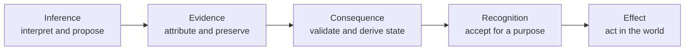

# From Inference To Consequence

## Policy Proposition

Trustworthy digital infrastructure needs three distinct capabilities:

> **Inference interprets.**
>
> **Evidence establishes what can be verified.**
>
> **Consequence determines what follows under identified rules.**

These capabilities are related, but they are not interchangeable.

An inference may be persuasive without being a fact. Evidence may be authentic
without being authorized or complete. A state may follow under technical rules
without being recognized for a particular legal, institutional, or commercial
purpose.

A fourth boundary therefore remains essential:

> **Recognition determines what is accepted and what external effect it has.**

Modern applications often combine all four functions inside one platform. The
application interprets information, records what happened, stores current
state, and presents its conclusion as authoritative. That arrangement is
convenient, but it also concentrates authority in software, databases, and
service providers that may be unavailable, replaced, disputed, or controlled
by another party.

The policy proposition of this paper is that inference, evidence, consequence,
and recognition should be separable. Applications should be able to use all of
them without exclusively owning any of them.

## The General Architecture

The three technical layers answer different questions.

| Layer | Function | Output | Governing question |
| --- | --- | --- | --- |
| Inference | Interpret information, identify patterns, classify, predict, summarize, and recommend. | Conclusions, explanations, predictions, and proposed actions. | What do we think? |
| Evidence | Preserve attributable and integrity-protected assertions and events concerning identifiable things. | Material that another party can independently verify. | What can we verify? |
| Consequence | Evaluate validated evidence under identified rules and determine the resulting state. | Reproducible consequential state. | What follows under these rules? |

Recognition connects those technical results to action in the world.

| Boundary | Function | Decision-maker | Governing question |
| --- | --- | --- | --- |
| Recognition and effect | Decide whether to accept the evidence and derived state for a purpose and determine the external result. | Relying party, institution, agreement, authority, community, or law. | What do we accept, and what happens because of it? |



The diagram describes responsibility boundaries, not a mandatory sequence.
Evidence can be created without prior inference. Inference can be applied to
evidence after it is created. Recognition may cause a party to reject a
technically valid state. The value of the model is that each conclusion can be
examined on its own terms.

## One Architecture, Many Implementations

The layers are technology-neutral. They can be implemented in different ways.

Inference may be performed by:

- people and professional judgment;
- statistical and machine-learning systems;
- large language models;
- deterministic analytics and rules engines; or
- combinations of human and machine reasoning.

Evidence may be preserved through:

- digital signatures and content digests;
- append-only journals;
- institutional archives;
- distributed event protocols;
- content-addressed storage;
- registries and attestations; or
- evidence packages exchanged directly between parties.

Consequence may be determined through:

- statutory or regulatory rules;
- contractual state machines;
- institutional rule books;
- deterministic protocol validators;
- registries;
- smart contracts; or
- other reproducible transition systems.

The architectural requirement is not that every system use the same
technology. It is that implementations disclose which function they perform,
what inputs and rules they rely on, and where their authority ends.

## Inference Is Source-Neutral

The architecture makes no protocol-level distinction based on who or what
performs the inference or creative act.

An interpretation, design, document, image, decision, or other digital output
may originate from:

- a person exercising judgment or creativity;
- an organization acting through its staff and systems;
- deterministic software;
- an autonomous agent using an LLM;
- a device or sensor; or
- collaboration among people and machines.

The resulting output can become a Digital Artifact if it is preserved as
persistent content with a stable content identity. Its digest identifies the
artifact without deciding whether its origin was human, machine, institutional,
or collaborative.

What happens next is the essence of the OpenETR question:

```text
human creativity       machine inference       human-machine collaboration
        \                     |                         /
         \                    |                        /
          -> persistent digital output -> Digital Artifact
                                         |
                     no consequential evidence | DCR evidence + rules
                              |                 |
                              v                 v
                     informational only   Consequential State
                                                |
                                                v
                                      recognition and effect
```

Not every Digital Artifact needs Consequential State. A draft, image, analysis,
story, model output, or private note may remain content and nothing more. Other
artifacts matter because actions concerning them affect a right, obligation,
status, permission, control position, institutional decision, or real-world
process.

OpenETR does not determine consequence from the prestige, identity, or nature
of the creator. It asks whether a DCR contains validated evidence from which an
identified rule book derives Consequential State concerning the artifact.

This gives human and machine creative acts equal technical standing at the
artifact and evidence layers. The protocol can identify their outputs, verify
attributable statements concerning them, and evaluate applicable rules without
first classifying the originating actor as human, organizational, or
autonomous.

Equal technical standing does not imply automatic equality of authority or
legal effect. A recognition policy may require human approval, institutional
mandate, professional qualification, disclosure of AI involvement, or a rule
that only a specified actor can perform a particular action. Those distinctions
belong to authorization and recognition, where they can be stated explicitly,
rather than being silently embedded in artifact identity.

The larger ecosystem can therefore accommodate creative acts by humans and
machines using a common architecture:

> Origin may explain how an artifact came to exist. Evidence and rules
> determine whether it has Consequential State. Recognition determines what
> standing and effect that state receives.

## The OpenETR Reference Stack

OpenETR currently demonstrates the general architecture through a particular
set of technologies:

> **LLMs are an important implementation of inference.**
>
> **Signed Nostr events are the current implementation of portable evidence.**
>
> **OpenETR implements consequence through DCR validation and rule-based state derivation.**

The relationship is:

| General layer | Current reference implementation | Role |
| --- | --- | --- |
| Inference | LLMs and other AI systems | Interpret artifacts and evidence, identify likely meaning, propose actions, and explain results. |
| Evidence | Nostr event format, signatures, identifiers, references, and compatible evidence storage | Produce attributable, tamper-evident statements that can be independently verified. |
| Consequence | OpenETR Digital Controllable Records, domain adapters, and verifier rule books | Validate related evidence and derive Consequential State concerning a Digital Artifact. |

Nostr relays are part of the current wire-format infrastructure. They accept,
store, filter, and return signed events. They help evidence travel and remain
available, but they do not create the evidentiary value of the signature and
they do not determine OpenETR state.

Likewise, LLMs are not the definition of inference, and Nostr is not the only
possible evidence protocol. OpenETR's conceptual model is broader than its
initial implementation choices. The current stack is useful because it makes
each layer concrete while preserving the boundaries among them.

## Layer One: Inference

### General function

Inference transforms observations into conclusions. It helps a person or
system decide what information probably means, how different facts relate, and
what action may be appropriate.

An inference system might conclude that:

- a document appears to be a warehouse receipt;
- a clause probably restricts transfer;
- an invoice and purchase order concern the same shipment;
- a product record indicates a possible compliance defect; or
- an action is inconsistent with an organization's policy.

The conclusion may be well supported and operationally useful. It remains
different from evidence that a particular actor made a statement or performed
an action.

### LLMs as an implementation

LLMs greatly expand the range of information that machines can interpret. They
can work across formats, vocabularies, jurisdictions, and levels of structure.
This reduces the need for every participant to adopt the same application or
document schema before information becomes intelligible.

LLM output is nevertheless generated inference. It should not be treated, by
itself, as proof of:

- who issued an artifact;
- whether an actor was authorized;
- whether an approval occurred;
- whether a transfer was accepted;
- whether authority was revoked;
- what current state follows; or
- what legal effect should be given to a result.

The appropriate question for this layer is:

> **What do we think, and how confident should we be?**

## Layer Two: Evidence

### General function

Evidence allows another party to examine the basis of a claim. In digital
infrastructure, strong evidence should be:

- attributable to an identifiable source or verification key;
- bound to the exact digital thing or event concerned;
- protected against undetectable alteration;
- linked to relevant prior or supporting evidence;
- portable beyond the application that created it; and
- independently verifiable using disclosed methods.

Evidence does not have to prove that a claim is true. It may establish that a
particular actor asserted something, that exact content existed, or that an
event was recorded in a particular relationship to another event.

The appropriate question for this layer is:

> **What can we independently verify?**

### Nostr as an implementation

Under NIP-01, a Nostr event contains a public key, timestamp, kind, tags,
content, event identifier, and signature. The identifier commits to the
serialized event data, and the signature can be checked against the author's
public key. Event references can connect signed statements to one another.

This supplies a compact evidence substrate:

```text
identified event data
  + content-derived event id
  + public key
  + signature
  + cryptographic references
  = independently verifiable signed statement
```

Relays transport and replicate these events:

```text
signed event
  -> relay A
  -> relay B
  -> application store
  -> institutional archive
  -> local evidence package
```

The same event can be copied without changing its identity or signature. A
relay acknowledgement is not a consensus vote, a judgment that the statement
is true, or a determination that the event changes state.

Larger artifacts may be preserved through content-addressed systems such as
Blossom, conventional object stores, institutional archives, or direct
evidence packages. The evidence architecture depends on stable identifiers and
verifiability, not on one required storage service.

## Layer Three: Consequence

### General function

Consequence is the layer in which validated evidence is evaluated under rules
and a resulting state is determined. It answers questions that neither
interpretation nor signature verification can answer alone:

- Is this record active or terminated?
- Did a proposed transfer become effective under the selected rules?
- Who is the current controller?
- Does an encumbrance remain outstanding?
- Was a prior authorization superseded or revoked?
- Which branch of conflicting evidence is accepted by this rule book?

Consequential state is a derived result. It should be traceable to the evidence
and rules that produced it.

The appropriate question for this layer is:

> **What follows from this validated evidence under these identified rules?**

### OpenETR as an implementation

OpenETR separates:

- the **Digital Artifact**, whose persistent content is identified by digest;
- the **Digital Controllable Record**, containing signed evidence concerning
  that artifact;
- the **Consequential State**, derived by evaluating validated DCR evidence
  under identified rules; and
- the **Digital Original**, the Digital Artifact for which Consequential State
  has been established through a DCR.

OpenETR can derive states such as:

- active, superseded, withdrawn, redeemed, or terminated;
- current controller;
- transfer proposed or accepted;
- encumbrance active or discharged;
- credential amended or revoked; or
- record changed from electronic to paper medium.

A conforming verifier obtains the relevant evidence, validates signatures and
relationships, applies an identified rule book, and reports the result together
with warnings and conflicts. The application may display or cache that result,
but it does not exclusively own the basis from which the result is derived.

## Recognition And Effect

Consequence is not the end of the analysis.

A technically valid result may still depend on questions such as:

- Is the signing key associated with a recognized person or organization?
- Was that actor authorized for this type of action?
- Is the rule book accepted for this transaction or jurisdiction?
- Is the available evidence sufficiently complete?
- Does applicable law recognize the technical method?
- What right, obligation, remedy, or operational action follows?

```text
validated evidence
  -> identified rules
  -> Consequential State
  -> contextual recognition
  -> external effect
```

OpenETR derives Consequential State. It does not unilaterally create legal
rights or compel another party to recognize the result. Recognition belongs to
the relying institution, agreement, community, authority, or applicable law.

This separation allows common technical evidence to support different
jurisdictions and institutional policies without presenting one conclusion as
universal protocol truth.

## Applications Become Interfaces Rather Than Authorities

Many digital platforms currently combine every layer:

```text
application interprets information
  -> application records what happened
  -> application database stores current state
  -> application decides what the user may do
  -> application presents the authoritative answer
```

That model works while all parties accept the operator and the service remains
available. It becomes fragile when records cross systems, vendors change,
platforms fail, participants require independent audit, or institutions apply
different recognition policies.

A layered architecture gives applications a narrower role:

```text
application interface
  -> invokes inference when useful
  -> creates or retrieves verifiable evidence
  -> invokes deterministic state derivation
  -> applies the institution's recognition policy
  -> presents and performs the authorized action
```

Applications remain responsible for authentication, authorization, workflow,
user experience, operational controls, and secure key use. They cease to be the
only place where the evidence and consequential result can be known.

This also supports replacement and integration. Different applications can use
different inference tools and user interfaces while evaluating the same
evidence under the same or explicitly different rule books.

## Implications For AI Governance

AI governance often treats explanation, logging, auditability, authorization,
and effect as one problem. The layered model separates their assurance needs.

| Claim | Required assurance |
| --- | --- |
| The system interpreted the input correctly. | Evaluation of inference quality, uncertainty, provenance, and fitness for purpose. |
| A person, agent, or service made a particular statement. | Attribution and integrity evidence. |
| The action was permitted. | Authorization, delegation, mandate, policy, and recognition evidence. |
| The action changed a record's state. | Evidence validation and deterministic transition rules. |
| Another institution should rely on the result. | Its own recognition policy, legal authority, and risk assessment. |

An LLM can help locate, compare, and explain evidence. It should not silently
improvise state transitions. Deterministic, versioned software should validate
the evidence and calculate Consequential State. An agent can then explain the
result, identify missing evidence, compare rule books, and present the decision
to the recognizing party.

Policy should require stronger, independently usable evidence as AI systems
move from interpretation toward consequential action.

## Public-Policy Applications

### Digital trade

Inference can interpret heterogeneous trade records and identify likely
parties, goods, obligations, and discrepancies. Evidence can establish who
made control-relevant statements concerning an exact record. Consequence rules
can derive transfer, encumbrance, discharge, surrender, and termination state.
MLETR-style law and commercial practice determine recognition and effect.

### Government digital services

Inference can assist with intake, classification, eligibility analysis, and
case summaries. Evidence can preserve decisions, approvals, notices, and
amendments beyond one case-management system. Consequence rules can make
resulting status changes reproducible, while legislation, delegated authority,
due process, and appeal rights remain controlling.

### AI governance

The model separates recommendations from attributable actions and
state-changing results. It supports agent accountability without treating a
model as the final authority or making one provider's logs the only audit
record.

It also avoids assigning technical standing according to whether an output was
created by a person or a machine. Human and machine-generated artifacts enter
the same evidence architecture. Governance can then impose the provenance,
approval, disclosure, or accountability requirements appropriate to the use.

### Supply chains

Inference can reconcile manifests, certificates, inspections, product
passports, and sensor reports. Evidence can preserve attributable claims about
specific goods or records. Consequence rules can derive lifecycle states such
as active, transferred, inspected, recalled, redeemed, or retired.

### Digital identity

Inference can help assess identity evidence. Cryptographic keys can attribute
statements. Neither function alone establishes the actor's legal identity,
mandate, licensing, or authority. Identity systems and recognition frameworks
remain responsible for those determinations.

### Electronic transferable records

Inference can interpret record contents and assist workflow. Signed evidence
can preserve consequential actions. OpenETR can derive control and lifecycle
state. Applicable reliable-method requirements and substantive law determine
whether the electronic record receives the effect of its paper equivalent.

### Digital public infrastructure

Public infrastructure should not require one application to own
interpretation, evidence, state, and recognition. Governments can support open
evidence and verification conventions while retaining democratic, statutory,
and institutional authority over recognition and effect.

## Relationship To Existing Standards And Systems

The architecture is intended to complement specialized legal frameworks,
trust infrastructures, and protocols.

| Framework or system | Primary contribution | Relationship to the layered architecture |
| --- | --- | --- |
| UNCITRAL MLETR | Technology-neutral legal framework for electronic transferable records, including identification, integrity, control, and reliable methods. | Supplies a legal recognition framework for a class of consequential records without prescribing one technology. |
| UCC Article 12 | Commercial-law rules for controllable electronic records and rights associated with control. | Provides legal classifications and effects that a qualifying consequence system may support. An OpenETR DCR is not automatically a UCC controllable electronic record. |
| Gaia-X | Trust-framework and data-space architecture using credentials, governance authorities, ecosystem rule books, and interoperable trust services. | Can supply participant, service, compliance, and recognition evidence around consequential records. |
| Nostr | Signed event format, key-based attribution, event references, and relay transport. | Implements a portable evidence layer in the current OpenETR stack. It does not determine OpenETR state or legal effect. |
| Cashu | Open Chaumian ecash protocol in which mints issue and redeem privacy-preserving tokens. | Demonstrates a specialized consequence system for bearer-style digital value, with different trust and spent-state assumptions. |
| Bitcoin | Peer-to-peer monetary system with globally ordered, consensus-derived transaction state. | Demonstrates independently verifiable consequence for money. OpenETR does not reproduce Bitcoin consensus and instead permits contextual rule books and recognition. |
| Digital Product Passports | Product-linked information, persistent identifiers, open formats, access rules, and regulatory traceability. | Supplies product-information requirements. A consequence layer can preserve evidence of lifecycle actions without replacing the passport or official registry. |

MLETR and UCC Article 12 demonstrate that legal consequence cannot be reduced
to document interpretation or signature verification. They preserve the role
of reliable methods, control, law, and institutional effect.

Gaia-X demonstrates how common technical compatibility can coexist with
ecosystem governance authorities and rule books. Nostr demonstrates portable
signed evidence. Cashu and Bitcoin demonstrate specialized consequence models
for digital money. Digital Product Passports demonstrate the need for durable,
interoperable information about products.

OpenETR occupies a particular position among these systems. It uses portable
evidence to derive artifact-specific Consequential State while keeping
recognition explicit and contextual.

## Policy Principles

1. **Do not confuse inference with evidence.** An interpretation should not be
   treated as proof of issuance, authority, authorization, control, or current
   state.
2. **Separate origin from consequence.** Human, machine, and collaborative
   outputs can have equal technical standing as Digital Artifacts. Whether an
   artifact acquires Consequential State depends on evidence and rules, while
   authority and external effect depend on recognition.
3. **Do not confuse evidence with consequence.** Authentic evidence can show
   that a statement was made without establishing that it changes state.
4. **Do not confuse consequence with external effect.** A reproducible state
   result does not compel recognition by an institution or legal system.
5. **Make the derivation basis portable.** Another authorized implementation
   should be able to obtain the evidence, rule-book identifier, warnings, and
   resulting state without depending on the originating application.
6. **Use deterministic state-transition rules.** AI may orchestrate and
   explain verification, but versioned code should calculate consequential
   state.
7. **Preserve rule-book plurality.** A verifier should disclose its rules and
   evidence scope rather than presenting one policy conclusion as universal.
8. **Keep applications replaceable.** Applications should provide excellent
   interfaces and controls without becoming the exclusive authority over the
   evidence and state they present.
9. **Design for completeness and retention.** Independent verification must
   address missing evidence, competing branches, archival policy, privacy,
   revocation, and evaluation time.

## Recommendations For Governments And Standards Bodies

1. **Specify assurance by layer.** Procurement and regulation should state
   separately what is required for inference quality, evidence integrity,
   state derivation, recognition, and external effect.
2. **Require portable verification material.** Consequential systems should
   expose the evidence, schemas, algorithms, rule-book version, and warnings
   needed for independent assessment.
3. **Avoid application-only authority.** A website or API response should not
   be the sole durable basis for consequential digital status.
4. **Treat AI as an interpreter, not an undisclosed state authority.** Agents
   may locate and explain evidence while deterministic software applies
   transition rules.
5. **Support interoperable evidence with contextual recognition.** Parties do
   not need to harmonize every legal conclusion before they can share
   verifiable evidence.
6. **Separate attribution from recognition.** A signing key can attribute a
   statement; identity, mandate, licensing, KYC, and authority require
   contextual evidence.
7. **Test failure independence.** Evidence and state derivation should remain
   usable when the originating model provider, application, website, database,
   relay, or platform is unavailable.
8. **Pilot complete accountability paths.** Demonstrations should connect
   inference, authorization, evidence, deterministic state, recognition, and
   remedy rather than showcasing only one layer.

## Conclusion

The most important architectural distinction is not between AI and
cryptography, or between centralized and decentralized systems. It is between
three functions that digital infrastructure must perform:

> systems that infer;
>
> systems that preserve evidence; and
>
> systems that determine consequence under identified rules.

These functions can be implemented using different technologies. In the
current OpenETR reference stack, LLMs provide a powerful inference capability,
Nostr provides portable signed evidence, and OpenETR derives Consequential
State from that evidence.

The architecture does not need to decide whether the originating creative act
was human or machine-made before it can identify the artifact and evaluate the
evidence concerning it. That source-neutrality allows human creativity,
autonomous inference, and collaboration between them to participate in one
larger digital ecosystem. Recognition remains free to impose the distinctions
required by ethics, policy, institutional mandate, or law.

Recognition then connects the technical result to institutional, commercial,
social, or legal effect.

The complete principle is:

> **Inference interprets. Evidence supports. Rules determine what follows.
> Recognition gives effect.**

## Further Reading

- [OpenETR Axioms](../openetr/axioms.md)
- [Consequential State](../openetr/consequential-state.md)
- [Recognition Boundary](../openetr/recognition.md)
- [Agentic AI Needs Consequential Evidence](./agentic-ai-and-consequential-evidence.md)
- [Open Verification For AI Actions And Consequential Digital Records](./open-verification-ai-actions-and-consequential-records.md)
- [Nostr NIP-01](https://nips.nostr.com/1)
- [UNCITRAL Model Law on Electronic Transferable Records](https://uncitral.un.org/en/texts/ecommerce/modellaw/electronic_transferable_records)
- [Uniform Law Commission: UCC And The 2022 Amendments](https://www.uniformlaws.org/acts/ucc)
- [Gaia-X Trust Framework Architecture](https://docs.gaia-x.eu/technical-committee/architecture-document/latest/trust_framework_architecture/)
- [Cashu Protocol](https://docs.cashu.space/protocol)
- [Bitcoin White Paper](https://bitcoin.org/en/bitcoin-paper)
- [EU Ecodesign Regulation And Digital Product Passports](https://eur-lex.europa.eu/eli/reg/2024/1781/eng)
