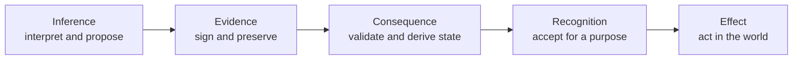

# From Inference To Consequence

## Policy Proposition

The next generation of digital infrastructure needs three distinct
capabilities:

> **LLMs enable inference.**  
> **Nostr relays enable evidence.**  
> **OpenETR enables consequence.**

This formulation is intentionally compact. Its precise architectural meaning
is:

- large language models and other AI systems interpret information and
  generate probabilistic conclusions;
- signed Nostr events provide attributable, tamper-evident evidence, while
  relays transport and replicate that evidence; and
- OpenETR organizes signed evidence into a Digital Controllable Record and
  applies identified rules to derive Consequential State.

Recognition remains a separate step. Institutions, agreements, communities,
authorities, and applicable law determine whether to accept the derived state
for a particular purpose and what external effect follows.

The three layers should remain separable. A system that can infer what a
document means should not thereby acquire authority to establish what happened
or decide what legal, institutional, or commercial consequence follows.

## The Architectural Observation

Artificial intelligence is rapidly reducing the cost of interpreting digital
information. An AI system can read unfamiliar documents, extract meaning from
unstructured content, compare policies, classify risks, and recommend actions.

That capability is important, but it does not answer several different
questions:

- Who made the relevant assertion?
- Does the evidence concern this exact digital artifact?
- Was the assertion altered after it was made?
- What other actions occurred before or after it?
- Which rule book determines the resulting state?
- Does a relying party recognize the signer, evidence, and result?
- What external effect should follow?

A plausible inference is not a fact merely because a capable model produced
it. A signed statement is not authoritative merely because its signature is
valid. A technically derived state does not have legal effect merely because a
protocol can reproduce it.

Trustworthy infrastructure must preserve these distinctions.

## Three Independent Layers

| Layer | Function | Representative technology | Output | Question answered |
| --- | --- | --- | --- | --- |
| Inference | Interpret, classify, predict, summarize, and recommend. | LLMs and other AI systems. | Probabilistic conclusions and proposed actions. | What do we think? |
| Evidence | Create and preserve attributable, tamper-evident statements concerning exact digital things. | Signed Nostr events, relay replication, content-addressed artifact storage, and archives. | Independently verifiable evidence. | What can we verify? |
| Consequence | Evaluate validated evidence according to identified rules and derive the resulting state. | OpenETR DCRs, domain adapters, and verifier rule books. | Reproducible Consequential State. | What changes under these rules? |

Recognition follows the three technical layers:

| Boundary | Function | Decision-maker | Question answered |
| --- | --- | --- | --- |
| Recognition and effect | Decide whether to accept the evidence and derived state for a purpose and determine the external result. | Relying party, institution, agreement, authority, community, or law. | What do we accept, and what follows in the world? |

The architecture can be summarized as:



This is not always a linear workflow. Evidence may be created by people,
devices, institutions, or deterministic software without an LLM. An AI system
may inspect evidence after state has already been derived. The diagram marks
responsibility boundaries, not a mandatory sequence for every transaction.

## Layer One: Inference

### Purpose

Inference systems transform information into interpretations, classifications,
predictions, summaries, and recommendations. They can make heterogeneous
digital material understandable without requiring every participant to adopt
the same document schema or application.

An AI system may determine that:

- a document appears to be a warehouse receipt;
- a clause probably restricts transfer;
- an invoice and purchase order refer to the same shipment;
- a product record indicates a possible compliance defect; or
- an agent should initiate a particular workflow.

These are useful conclusions. They are not, by themselves, evidence of
issuance, authority, control, discharge, revocation, or legal effect.

### Governing question

> **What do we think?**

The answer may be highly reliable, but it remains an inference whose basis,
uncertainty, and appropriate use should be disclosed.

### Policy boundary

AI governance should distinguish systems that produce advice from systems that
can change consequential state. A model may recommend transferring a record,
but a separate authority and evidence path should determine whether the
transfer is authorized, record what occurred, and establish the state that
follows.

## Layer Two: Evidence

### Purpose

The evidence layer produces durable statements that another implementation can
verify without trusting the application that displays them.

Under NIP-01, a Nostr event contains a public key, timestamp, kind, tags,
content, event identifier, and signature. The event identifier is derived from
the serialized event data, and the signature is checked against the author's
public key. Event-reference tags can connect one signed statement to another.

Relays accept, store, filter, and return events. Multiple relays can carry the
same event without changing its identifier or signature. An application,
archive, or evidence package can preserve the same event independently of the
relay that first received it.

Content-addressed stores such as Blossom can preserve larger artifacts outside
the event stream while allowing their bytes to be identified by digest. Other
local, institutional, or commercial storage systems can perform the same
artifact-preservation function.

### Governing question

> **What can we verify?**

The evidence layer can establish that a particular key signed an exact
statement concerning an identified object. It does not, by itself, establish
that the statement is true, authorized, complete, or legally effective.

### Relays are not authorities

The phrase “Nostr relays enable evidence” is useful shorthand, but the
signature and event structure make the evidence independently verifiable.
Relays provide discovery, transport, replication, and availability.

```text
signed event
  -> relay A
  -> relay B
  -> application store
  -> institutional archive
  -> local evidence package
```

A relay acknowledgement is not a consensus vote. It does not determine whether
an event changes state. A relay may refuse or later delete an event without
invalidating copies retained elsewhere.

## Layer Three: Consequence

### Purpose

OpenETR turns a set of signed records into a Digital Controllable Record and
defines how identified rules derive Consequential State concerning a Digital
Artifact.

The model separates:

- the **Digital Artifact**, whose persistent content is identified by digest;
- the **Digital Controllable Record**, containing signed evidence concerning
  that artifact;
- the **Consequential State**, derived by evaluating validated DCR evidence
  under identified rules; and
- the **Digital Original**, the Digital Artifact for which Consequential State
  has been established through a DCR.

Examples of Consequential State may include:

- active, superseded, withdrawn, redeemed, or terminated;
- current controller;
- transfer proposed or accepted;
- an encumbrance active or discharged;
- a credential amended or revoked; or
- a record changed from electronic to paper medium.

### Governing question

> **What changes under these rules?**

OpenETR does not make an application database, website, relay, or blockchain
the exclusive owner of the answer. A conforming verifier can obtain the signed
evidence, validate it, apply the identified rule book, and reproduce the state.

### Consequence is not automatic legal effect

OpenETR enables independently derivable Consequential State. It does not
unilaterally create legal rights or compel another party to recognize the
result.

```text
validated DCR evidence
  -> identified rules
  -> Consequential State
  -> contextual recognition
  -> external effect
```

This boundary is essential to OpenETR's applicability across institutions and
jurisdictions. The protocol can remain common while recognition remains plural.

## Applications Become Interfaces Rather Than Authorities

Many current systems combine inference, evidence, state, recognition, and
effect inside one application:

```text
application interprets information
  -> application records what happened
  -> application database stores current state
  -> application decides what the user may do
  -> application displays the authoritative answer
```

This arrangement is convenient while the application remains available and
all parties accept its operator. It becomes fragile when records cross systems,
providers fail, participants need independent audit, or institutions apply
different recognition rules.

The layered approach gives applications a narrower and healthier role:

```text
application interface
  -> invokes inference where useful
  -> creates or retrieves signed evidence
  -> invokes a deterministic state verifier
  -> applies the institution's recognition policy
  -> presents and carries out the authorized action
```

The application remains responsible for authentication, authorization,
workflow, user experience, operational controls, and secure key use. It simply
ceases to be the only place where the evidence and consequential result can be
known.

## Why Separation Matters For AI Governance

AI governance often treats explanation, logging, and auditability as if they
were one problem. The three-layer model exposes distinct assurance questions.

| Claim | Required assurance |
| --- | --- |
| The model interpreted the input correctly. | Evaluation of inference quality, uncertainty, provenance, and fitness for purpose. |
| The agent or user made a particular statement. | Cryptographic attribution and integrity evidence. |
| The action was permitted. | Authorization, delegation, policy, and recognition evidence. |
| The action changed the record's state. | DCR validation and deterministic state-transition rules. |
| Another institution should rely on the result. | Its own recognition policy, legal mandate, and risk assessment. |

An application log may record what an agent claims to have done. A signed event
can make a statement attributable and tamper-evident. OpenETR can connect that
statement to an exact digital artifact and determine what state follows under
defined rules. None of those steps proves that the original inference was
correct or that a court, regulator, bank, or counterparty must accept the
result.

Policy should therefore require stronger, independently usable evidence as AI
systems move from interpretation toward consequential action.

## Public-Policy Applications

### Digital trade

AI can interpret heterogeneous trade documents and identify likely parties,
goods, obligations, and discrepancies. Signed evidence can establish who made
control-relevant statements concerning the exact document. OpenETR can derive
transfer, encumbrance, discharge, surrender, and termination state. MLETR-style
law and commercial practice determine recognition and effect.

### Government digital services

AI can assist with intake, classification, eligibility analysis, and case
summaries. Signed records can preserve decisions, approvals, notices, and
amendments beyond one case-management system. OpenETR can make resulting status
changes reproducible, while legislation, delegated authority, due process, and
appeal rights remain controlling.

### AI governance

The model separates probabilistic recommendations from attributable actions
and state-changing results. It supports agent accountability without treating
the model as the final authority or making one provider's logs the only audit
record.

### Supply chains

AI can reconcile manifests, certificates, inspections, product passports, and
sensor reports. The evidence layer can preserve attributable claims concerning
specific goods or records. OpenETR can derive lifecycle states such as active,
transferred, inspected, recalled, redeemed, or retired under sector rules.

### Digital identity

AI can help match, interpret, and assess identity evidence. Cryptographic keys
can attribute signed statements. OpenETR remains actor-neutral: a key does not
by itself prove whether the signer is a person, organization, service, device,
or agent. Identity systems and recognition frameworks decide who or what is
associated with the key and which authority it possesses.

### Electronic transferable records

AI can interpret record contents and assist workflow. Signed DCR evidence can
record consequential actions. OpenETR can derive control and lifecycle state.
Applicable reliable-method requirements and substantive law determine whether
the electronic record receives the effect of its paper equivalent.

### Digital public infrastructure

Public infrastructure should not require one application to own interpretation,
evidence, state, and recognition. Governments can support open evidence and
verification conventions while retaining democratic, statutory, and
institutional authority over recognition and effect.

## Relationship To Existing Standards And Systems

OpenETR is intended to complement specialized legal frameworks, trust
infrastructures, and protocols.

| Framework or system | Primary contribution | Relationship to the three-layer model |
| --- | --- | --- |
| UNCITRAL MLETR | Technology-neutral legal framework for the functional equivalence of electronic transferable records, including identification, integrity, and control through a reliable method. | Supplies a legal recognition framework for particular consequential records; it does not prescribe OpenETR or any one technology. |
| UCC Article 12 | Commercial-law rules for controllable electronic records and certain rights associated with control. | Provides legal classifications and effects that a qualifying implementation may support. An OpenETR DCR is not automatically a UCC controllable electronic record. |
| Gaia-X | Trust-framework and data-space architecture using credentials, governance authorities, ecosystem rule books, and interoperable trust services. | Can supply participant, service, compliance, and recognition evidence around OpenETR records; OpenETR can add artifact-specific consequential state. |
| Nostr | Signed event format, key-based attribution, event references, and relay transport. | Supplies the present evidence substrate and transport binding. Nostr does not determine OpenETR state or legal effect. |
| Cashu | Open Chaumian ecash protocol in which mints issue and redeem privacy-preserving tokens. | Demonstrates a specialized consequence system for bearer-style digital value. Mint trust and spent-state semantics differ from OpenETR's general DCR model. |
| Bitcoin | Peer-to-peer monetary system with globally ordered, consensus-derived transaction state. | Demonstrates independently verifiable consequential state for money. OpenETR does not reproduce Bitcoin consensus; it supports plural rule books and contextual recognition. |
| Digital Product Passports | Product-linked information, persistent identifiers, open formats, access rules, and regulatory traceability. | Supplies product-information and regulatory requirements. OpenETR can preserve evidence of consequential lifecycle actions without replacing the passport or its official registry. |

### MLETR and UCC Article 12

The UNCITRAL Model Law on Electronic Transferable Records is technology-neutral
and permits registries, tokens, distributed ledgers, and other reliable methods.
It identifies legal functions such as record identification, integrity,
control, exclusive control, and identification of the person in control.

UCC Article 12 addresses controllable electronic records and commercial rights
associated with control. Both legal frameworks demonstrate why consequence
cannot be reduced to document interpretation. They also preserve the role of
law in determining whether a technical method and resulting state receive
legal effect.

OpenETR can provide evidence and derivation relevant to those analyses. It does
not declare compliance or legal status merely because an artifact has a DCR.

### Gaia-X

Gaia-X explicitly combines technical interoperability with ecosystem-defined
governance and rule books. That is complementary to OpenETR's recognition
boundary. Gaia-X-style credentials and trust services can help determine which
participants or services are recognized, while OpenETR concerns the signed
evidence and Consequential State of a particular digital artifact.

### Nostr and content-addressed storage

Nostr provides signed events, event identifiers, references, and relay
transport. Content-addressed systems can preserve the larger artifacts to
which those events refer. OpenETR supplies the semantic and state-transition
rules that neither storage nor transport provides on its own.

### Cashu and Bitcoin

Cashu and Bitcoin show two specialized ways of producing consequence for
digital money. Cashu relies on mint-issued proofs and mint-maintained spent
state. Bitcoin relies on a globally replicated consensus history.

OpenETR learns from both without treating every consequential record as money.
Many institutions and jurisdictions may need to evaluate the same evidence
without agreeing to one global state machine. OpenETR therefore preserves
portable evidence and identified rules while leaving recognition contextual.

### Digital Product Passports

Digital Product Passports make product information persistently identifiable,
machine-readable, transferable, and accessible under defined rules. OpenETR can
complement a passport by recording independently verifiable evidence of events
that change what follows for the product, such as inspection, repair, recall,
transfer, withdrawal, or retirement.

## Policy Principles

### 1. Do not confuse inference with evidence

AI-generated interpretations should identify their provenance and uncertainty.
They should not be treated as proof of issuance, authority, authorization,
control, revocation, or current state.

### 2. Do not confuse evidence with consequence

A valid signature establishes attribution and integrity. It does not establish
that the signer was authorized or that the statement changes state.

### 3. Do not confuse derived state with external effect

Consequential State is a reproducible protocol result. Recognition and effect
remain decisions for the relevant institution, agreement, community, or law.

### 4. Make the derivation basis portable

Another authorized implementation should be able to obtain the artifact
identity, signed evidence, rule-book identifier, warnings, and resulting state
without depending on the originating application.

### 5. Require deterministic state transitions

AI may locate, summarize, compare, and explain evidence. Deterministic,
versioned code should validate DCR evidence and calculate Consequential State.
The model should not improvise state transitions from prose.

### 6. Preserve rule-book plurality

Common evidence should support multiple institutions and jurisdictions. A
verifier should disclose which rule book it used rather than presenting one
policy conclusion as universal protocol truth.

### 7. Keep applications replaceable

Applications should provide excellent interfaces, authentication, workflow,
and operational controls without becoming the exclusive authority over the
evidence and state they present.

### 8. Design for evidence completeness and retention

Independent verification requires more than valid records. Implementers must
address missing evidence, competing branches, archival policy, privacy,
revocation, and the time at which a result was evaluated.

## Recommendations For Governments And Standards Bodies

1. **Specify assurance by layer.** Procurement and regulation should state
   separately what is required for inference quality, evidence integrity,
   state derivation, recognition, and external effect.
2. **Require portable verification material.** Consequential systems should
   expose the evidence, schemas, algorithms, rule-book version, and warnings
   needed for independent assessment.
3. **Avoid application-only authority.** A website or API response should not
   be the sole durable basis for a consequential digital status.
4. **Use AI as an interpreter, not an undisclosed state authority.** Agents may
   orchestrate verification and explain results, while deterministic software
   applies state-transition rules.
5. **Support interoperable evidence with local recognition.** Cross-border and
   cross-institutional systems need not harmonize every legal conclusion to
   share verifiable evidence.
6. **Separate actor attribution from actor recognition.** A signing key can
   attribute a statement; identity, mandate, licensing, KYC, and authority
   require contextual evidence.
7. **Test failure independence.** Evidence and state derivation should remain
   usable when the originating model provider, application, website, database,
   relay, or platform is unavailable.
8. **Pilot complete chains of accountability.** Demonstrations should connect
   inference, authorization, signed evidence, deterministic state, recognition,
   and remedy rather than showcasing only one technical layer.

## Conclusion

AI is making digital information easier to interpret. Nostr demonstrates that
signed statements can travel across applications and remain independently
verifiable. OpenETR adds a distinct capability: rules can derive consequential
state concerning an exact digital artifact without making one application,
website, database, or platform the permanent authority.

The architecture is not complete until recognition is made explicit. OpenETR
can determine what state follows under identified rules; institutions and law
determine whether that state is accepted and what happens because of it.

Trustworthy digital infrastructure therefore requires separable capabilities:

> systems that infer;  
> systems that preserve evidence; and  
> systems that determine consequence under identified rules.

Recognition then connects those technical capabilities to institutional,
commercial, and legal effect.

The resulting principle is straightforward:

> **Inference proposes. Evidence supports. Rules determine what follows.
> Recognition gives effect.**

## Further Reading

- [OpenETR Axioms](../openetr/axioms.md)
- [Consequential State](../openetr/consequential-state.md)
- [Recognition Boundary](../openetr/recognition.md)
- [Agentic AI Needs Consequential Evidence](./agentic-ai-and-consequential-evidence.md)
- [Open Verification For AI Actions And Consequential Digital Records](./open-verification-ai-actions-and-consequential-records.md)
- [Nostr NIP-01](https://nips.nostr.com/1)
- [UNCITRAL Model Law on Electronic Transferable Records](https://uncitral.un.org/en/texts/ecommerce/modellaw/electronic_transferable_records)
- [Uniform Law Commission: UCC And The 2022 Amendments](https://www.uniformlaws.org/acts/ucc)
- [Gaia-X Trust Framework Architecture](https://docs.gaia-x.eu/technical-committee/architecture-document/latest/trust_framework_architecture/)
- [Cashu Protocol](https://docs.cashu.space/protocol)
- [Bitcoin White Paper](https://bitcoin.org/en/bitcoin-paper)
- [EU Ecodesign Regulation And Digital Product Passports](https://eur-lex.europa.eu/eli/reg/2024/1781/eng)
