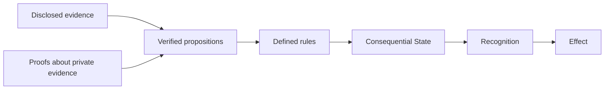

# Independent Verification Without Full Disclosure

A party may need to establish that a transfer was authorized without revealing
an entire mandate, or that an organization holds a qualifying accreditation
without exposing every supporting record. Asking for all the source material
can impose unnecessary disclosure and retention burdens.

The OpenETR principle is that **Consequential State should be independently
derivable from sufficient verifiable evidence under defined rules**. Independent
verification does not necessarily require full disclosure of the information
behind that evidence.

This is a refinement of the architecture and a direction for future evidence
profiles. OpenETR's base protocol uses artifact digests and signed events; this
brief does not announce implemented zero-knowledge verification or private
control transfers.

## Evidence And Disclosure Are Separate Questions

A rulebook should identify the proposition needed for a decision and the
evidence mechanisms it accepts. For example, it may require proof that a
mandate covered a particular action at a particular time. Inspecting a signed
mandate is one possible mechanism. A suitable cryptographic proof could be
another, if it establishes the required scope, issuer, validity, and binding
to that action.

The assurance comes from checking the evidence using a defined procedure.
It does not come from how much information a verifier collects. An unsupported
claim that private evidence exists is insufficient, and a valid signature
alone does not prove every claim made by its signer.

> Rules define what must be proven for consequence to follow, not necessarily
> everything that must be revealed.

Institutions still decide which issuers and mechanisms they recognize. A
proof of credential possession does not automatically prove authority to
transfer a particular record. An institution's attestation can be useful
evidence, but relying on it retains a dependency on that institution.

## The Control Layer Remains Central

OpenETR connects a Digital Artifact to external signed evidence forming a
Digital Controllable Record (DCR). Rules evaluate that evidence to derive
Consequential State, including control where a transferable-record ruleset
defines it. Recognition determines what legal, contractual, or institutional
effect to give that result.

**Artifacts carry content. Evidence carries history. Rules derive consequence.**
The proof is outside the artifact. The file need not contain its own control
history or OpenETR metadata, allowing the same approach to work across document
formats. Byte identity remains exact: the digest identifies the bytes, while
evidence and rules establish what follows concerning them.

A future evidence profile could allow a verifier to establish a required fact
without seeing all its supporting records. The design note calls this a
*verified proposition*: a conclusion with a defined subject, scope, procedure,
and evidence basis. It is an extension point, not a new token or a universal
approval label.

## A Transfer Example

Consider a warehouse-receipt rulebook that requires authorization, recipient
acceptance, and the absence of a blocking encumbrance. These are illustrative
requirements; they are not a change to every OpenETR transfer profile.

| Decision question | Possible evidence | Necessary qualification |
| --- | --- | --- |
| Was this action authorized? | A signed mandate or an accepted proof of mandate scope | It must cover this actor, action, and relevant time |
| Did the recipient accept? | Signed acceptance or a proof bound to that acceptance | Eligibility alone does not demonstrate consent |
| Is there a blocking encumbrance? | Relevant history or a proof against an authenticated record set | The verifier needs a basis for that set's coverage and freshness |

The last question is especially important. Failing to find an encumbrance in
one source does not prove that none exists. A privacy-preserving proof about
a partial set does not make the set complete. Where the required evidence is
unavailable, the responsible result may be insufficient evidence.

Different parties may have access to different evidence. Reproducibility
means that conforming verifiers using the same evidence, rules, parameters,
and dependencies reach the same result. That result may identify conflicting
claims rather than a single controller. OpenETR can preserve multiple signed
assertions without treating every assertion as having equal standing.

## Durable Verification

A decision may need to be examined years after the transaction. Privacy should
not make its evidentiary basis depend on a service that no longer exists.

Future profiles should preserve the proof, its public inputs and commitments,
verification parameters, applicable rules and versions, and relevant temporal
and revocation evidence. A later verifier should be able to repeat the required
checks without necessarily receiving the original private records.

> Durability of verification does not require durability of disclosure.

That objective still depends on preserving the verification material and on
the security of its cryptographic assumptions. A proof generated later does
not establish that it existed at the time of the original action. Historical
claims require explicit evidence about time and scope.

## Privacy Beyond Hidden Content

Keeping the document private is only part of the problem. Digests, signing
keys, timestamps, and graph relationships can reveal associations. Someone
who can guess a document's exact contents may calculate its digest and test
for a match. A digest is not encryption or a guarantee of confidentiality.

Similarly, attaching a private proof to a public signed event does not hide
the event's signing key. Private controller identity and continuity require
further profile design. Disclosure permissions, storage access, logging, and
retention remain application and institutional responsibilities.

This complements [Graduated Disclosure](graduated-disclosure.md), which asks
how much access a decision warrants. Privacy-preserving evidence additionally
asks whether the necessary proposition can be established with less exposure
of the supporting information.

## Policy Direction

Procurement requirements and institutional rulebooks should specify required
propositions, acceptable verification procedures, evidence scope, and retention
needs. Requiring complete source disclosure by default can collect more data
without establishing the fact that matters.

OpenETR's architectural objective remains independently reproducible
consequence, with contextual Recognition and Effect. Optional privacy-preserving
profiles can support that objective when they preserve the evidence needed
to verify the result and clearly identify what remains unproven.

## Design Basis And Related Reading

- [Private Evidence And Verified Propositions Design Note](https://github.com/trbouma/openetr/blob/main/docs/specs/PRIVATE_EVIDENCE_AND_VERIFIED_PROPOSITIONS_DESIGN_NOTE.md)
- [Generic Verifier Policy](https://github.com/trbouma/openetr/blob/main/docs/specs/OPENETR_GENERIC_VERIFIER_POLICY.md)
- [Consequential State Architecture](https://github.com/trbouma/openetr/blob/main/docs/specs/CONSEQUENTIAL_STATE_ARCHITECTURE_DESIGN_NOTE.md)
- [ZK-SNARKs And Hash Commitments](https://github.com/trbouma/openetr/blob/main/docs/specs/ZK_SNARKS_AND_HASH_COMMITMENTS_DESIGN_NOTE.md)
- [Policy Guards And Cryptographic Evidence](policy-guards-and-cryptographic-evidence.md)
- [Why Control Is Not Recognition](why-control-is-not-recognition.md)
