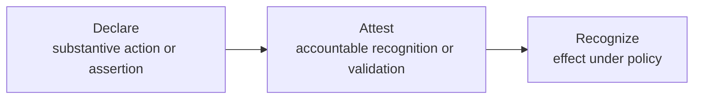
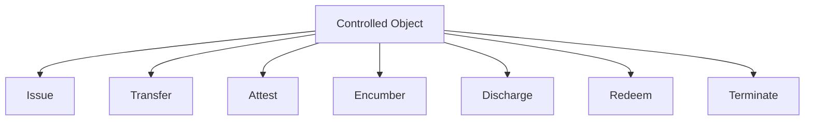
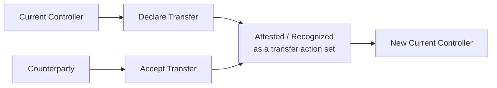
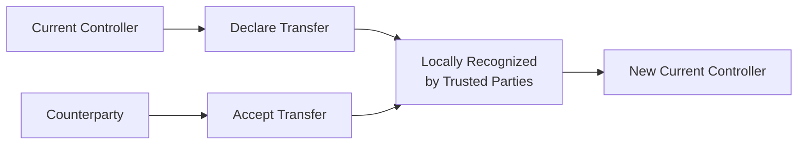
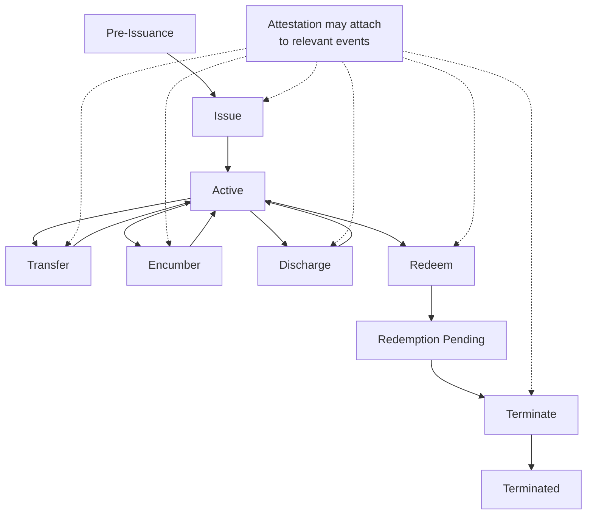
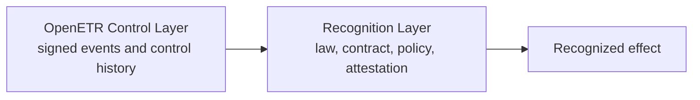
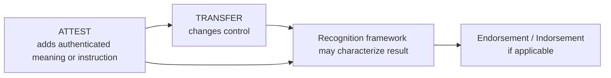

# Canonical ETR Transaction Infographic

This note is a simplified visual companion to [CANONICAL_ETR_TRANSACTION_SPEC.md](./CANONICAL_ETR_TRANSACTION_SPEC.md).

It is intended to help readers quickly visualize the canonical model without replacing the full specification.

## 1. Core Logic

Key idea:

- publication alone does not equal effect
- effect depends on recognition
- attestation provides the stronger basis for recognition

## 2. Canonical Action Families

Key idea:

- `Issue`, `Transfer`, `Encumber`, `Discharge`, `Redeem`, and `Terminate` are lifecycle-relevant actions
- `Attest` adds authenticated assertions and may also support recognition of other actions

## 3. Transfer in the Strong Canonical Model

Key idea:

- the strong canonical model treats transfer as more than mere publication
- recognition may depend on both declaration and acceptance

## 4. Narrow Trusted-Counterparty Variant

Key idea:

- a small, otherwise trusted set of parties may choose to recognize effect without separate third-party attestation
- this is a weaker profile for portability, independent verification, and later dispute resolution

## 5. Lifecycle View

Key idea:

- multiple lifecycle actions may occur while the object is active
- attestation is not itself a lifecycle state transition, even though lifecycle events may be attested
- termination ends the active lifecycle

## 6. Control Layer vs Recognition Layer

Key idea:

- OpenETR records authenticated facts
- the Recognition Layer determines legal or operational effect

## 7. Endorsement / Indorsement in the Revised Model

Key idea:

- endorsement or indorsement is not a standalone universal protocol primitive
- it is a recognition-layer characterization of one or more underlying OpenETR events
