# Controllable Records Taxonomy

## Status

Draft.

## Purpose

This note defines the broader family of **controllable records** and explains how electronic transferable records, non-transferable records, credentials, linked evidence, and registry-recognized records fit within that family.

It also clarifies a terminology boundary that is important in OpenETR:

- the **Controlled Object** is the artifact, document, file, credential, record bundle, or data object identified by digest;
- the **Control Graph** is the signed OpenETR event history associated with that object;
- the **Controllable Record** is the broader conceptual and policy category: the controlled object understood together with its control graph and the recognition context that gives the evidence practical meaning.

The goal is to keep OpenETR's broader architecture visible while preserving the OpenETR brand and its connection to electronic transferable records.

## Core Claim

**OpenETR** is a general control layer for durable, controllable electronic records.

An **electronic transferable record** is an important subclass of controllable record, but it is not the entire category. Some controllable records require transfer of control. Others require authority, lifecycle evidence, presentation, revocation, linked evidence, or recognition under a domain rulebook without becoming transferable in the negotiable-document sense.

## Taxonomy

```mermaid
flowchart TD
    CR["Controllable Records<br/>controlled objects plus control graphs evaluated under recognition context"]

    ETR["Electronic Transferable Records<br/>control transfer may have legal or commercial transfer effect"]
    NTR["Non-Transferable Controllable Records<br/>control, stewardship, status, or lifecycle evidence without negotiability"]
    CRED["Credentials And Attestations<br/>claim-centric records used for presentation and reliance"]
    LER["Linked Evidence Records<br/>supporting artifacts associated with a controlled object"]
    RAR["Registry Or Authority Recognized Records<br/>records whose effect depends on an external rulebook"]

    CR --> ETR
    CR --> NTR
    CR --> CRED
    CR --> LER
    CR --> RAR

    ETR --> WR["Warehouse Receipts"]
    ETR --> BL["Bills Of Lading"]
    ETR --> PN["Promissory Notes"]

    NTR --> DPP["Product Passports"]
    NTR --> HR["Health Records"]
    NTR --> AP["Apostille Documents"]

    CRED --> VC["Verifiable Credentials"]
    CRED --> MDL["Mobile Driver's Licenses"]
    CRED --> AUTH["Authority Or Role Credentials"]

    LER --> INS["Inspection Reports"]
    LER --> REP["Repair Or Lifecycle Evidence"]
    LER --> CERT["Certificates And Test Results"]

    RAR --> REG["Registries"]
    RAR --> TF["Trust Frameworks"]
    RAR --> CA["Competent Authorities"]
```



## Definitions

### Controllable Record

A **controllable record** is not merely the underlying file or artifact.

In OpenETR terms:

- the **Controlled Object** is the record artifact itself, such as a PDF, image, JSON document, credential, registry export, document bundle, product data artifact, certificate, or other canonical electronic artifact;
- the object is identified by cryptographic digest;
- signed OpenETR events about that object are **control records**;
- the linked set of those events is the object's **control graph**;
- recognition policy decides what practical, legal, regulatory, commercial, or operational effect to give the graph.

A **controllable record** is therefore best understood as:

```text
Controllable Record
  = Controlled Object
  + Control Graph
  + Recognition Context
```

The Controlled Object is the artifact at the center of the controllable record. The Control Graph is the signed evidence that makes its control state durable and inspectable. The recognition context is the rulebook, law, registry policy, institutional policy, verifier profile, or relying-party judgment that gives the evidence meaning.

### Electronic Transferable Record

An **electronic transferable record** is a controllable record where transfer of control is intended to have legal, commercial, or operational effect comparable to transfer or possession of a paper transferable record.

Examples include:

- electronic warehouse receipts;
- electronic bills of lading;
- electronic promissory notes;
- other documents or instruments recognized under an MLETR-style, MLWR-style, contractual, registry, or institutional framework.

OpenETR can provide control evidence for these records. It does not, by itself, decide whether a particular record satisfies the legal requirements for transferable-record recognition.

### Non-Transferable Controllable Record

A **non-transferable controllable record** is a controllable record whose control graph matters, but whose ordinary purpose is not transfer of legal entitlement.

Examples include:

- Digital Product Passports;
- health records;
- apostille documents;
- permits;
- certificates;
- product lifecycle artifacts;
- compliance records.

These records may need issuance, update, attestation, revocation, termination, linked evidence, or recognized authority, but they may not need a transfer event at all.

### Credential Or Attestation

A **credential** is usually claim-centric. It records assertions by an issuer about a subject and is presented to a verifier for reliance.

Credentials can fit into the controllable-record family in two ways:

- the credential itself may be the Controlled Object;
- the credential may be linked evidence or an authority signal that supports recognition of an OpenETR event.

This includes W3C Verifiable Credentials, mobile driver's licenses, role credentials, authority credentials, accreditation credentials, or organization credentials.

### Linked Evidence Record

A **linked evidence record** is supporting evidence associated with a controlled object or control graph.

Linked evidence may include inspection reports, test results, photographs, repair records, certificates, audit reports, registry extracts, or other records that should remain independently digest-addressed and verifiable.

Linked evidence is important for non-transferable domains such as Product Passports, but it can also support transferable-record workflows such as warehouse receipts and bills of lading.

### Registry Or Authority Recognized Record

Some controllable records depend on a registry, competent authority, trust framework, court, regulator, platform, or institutional rulebook for recognition.

In these cases, OpenETR can preserve signed evidence, but effect depends on the recognition layer. A registry or authority may decide:

- which issuers are recognized;
- which profile keys are authorized;
- which credentials or attestations are required;
- which control graph branches are accepted;
- which records are active, suspended, superseded, or terminated under the rulebook.

## OpenETR Layering

The taxonomy is not meant to collapse all record types into one legal category.

Instead, it clarifies the layers:

```text
Record family         controllable records
Domain category       ETRs, non-transferable records, credentials, linked evidence, registry records
OpenETR control layer controlled objects, control records, control graphs, profiles, policy guards
Wire format           signed events, kinds, tags, relays, object queries
Recognition layer     law, contracts, registries, trust frameworks, competent authorities, verifier policy
```

OpenETR should remain precise at the control layer:

- identify the controlled object;
- publish signed control records;
- derive candidate state from the control graph;
- expose policy guards and warnings;
- preserve linked evidence;
- leave recognition to the applicable framework.

## Relationship To Electronic Transferable Records

Electronic transferable records remain a central OpenETR use case.

They are especially important because the control state of the record can have high legal or commercial significance. Transfer of control may affect entitlement, title, delivery rights, security interests, or payment obligations.

But the OpenETR control graph model is broader than transferability:

- `issue` can create an origin control record for many record types;
- `attest` can add signed evidence or authority;
- `encumber` and `discharge` can express restrictions and releases;
- `redeem` can express presentation or request for performance;
- `terminate` can mark lifecycle closure;
- linked evidence can associate supporting records without transferring the original record.

This means OpenETR can support ETR workflows while also serving as a general control layer for other durable electronic records.

## Relationship To Credentials

Credentials are usually centered on claims and presentation:

```text
What does this credential say?
Who issued it?
Who presents it?
Should this verifier rely on it?
```

OpenETR is centered on object history:

```text
What is the controlled object?
Who issued the origin control record?
What signed events exist for this object?
Who is the current controller, if any?
What evidence is linked?
What should a verifier recognize under its policy?
```

These models are complementary.

A credential may authorize a participant to issue or act on a control graph. A credential may also be the controlled object itself. A verifier may use credentials, registry lookups, or authority attestations as recognition inputs when evaluating the OpenETR graph.

## Design Implications

The controllable-record taxonomy suggests several design rules:

1. OpenETR should not hard-code transfer as the only meaningful lifecycle event.
2. Transferable-record workflows should remain first-class, but not exclusive.
3. Non-transferable records should be able to use origin, attestation, linked evidence, lifecycle, and recognition patterns without pretending to be negotiable instruments.
4. Credentials should be treated as complementary recognition inputs or as specialized controlled objects.
5. Domain adapters should choose the vocabulary that fits the domain while mapping to the same OpenETR control layer.
6. Recognition should remain outside the base protocol and should be expressed through policy, registries, trust frameworks, credentials, attestations, or verifier profiles.

## Summary

**Controllable records** are the umbrella category.

**Electronic transferable records** are a high-value subclass where control transfer can have legal or commercial effect.

**Non-transferable controllable records**, **credentials**, **linked evidence records**, and **registry-recognized records** are also part of the broader family because they need durable signed evidence about record identity, lifecycle, authority, status, or recognition.

The Controlled Object should not be treated as synonymous with the Controllable Record. The object is the digest-addressed artifact. The controllable record is the object plus the signed control graph and the recognition context used to evaluate it.

OpenETR can keep its brand focus while making this broader architecture explicit:

> OpenETR is a control layer for electronic transferable records and other controllable records.

## Related Notes

- [OPENETR_LAYERED_ARCHITECTURE_NOTE.md](./OPENETR_LAYERED_ARCHITECTURE_NOTE.md)
- [VC_AND_MDL_AS_SPECIALIZED_INSTANCES_OF_OPENETR_NOTE.md](./VC_AND_MDL_AS_SPECIALIZED_INSTANCES_OF_OPENETR_NOTE.md)
- [EUDI_WALLET_AND_OPENETR_DESIGN_NOTE.md](./EUDI_WALLET_AND_OPENETR_DESIGN_NOTE.md)
- [LINKED_EVIDENCE_RECORD_KIND_DESIGN_NOTE.md](./LINKED_EVIDENCE_RECORD_KIND_DESIGN_NOTE.md)
- [OPENETR_GENERIC_VERIFIER_POLICY.md](./OPENETR_GENERIC_VERIFIER_POLICY.md)
