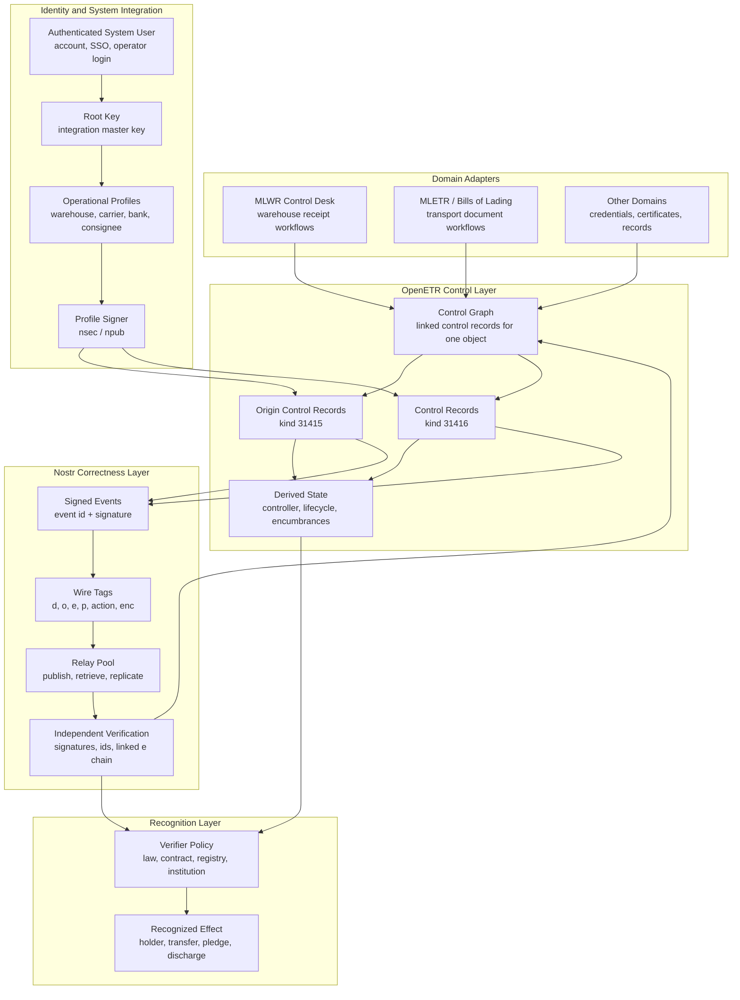

# OpenETR Control Graph Infographic

This infographic ties together the main OpenETR design idea:

> A cryptographically verifiable control graph sits at the center. Nostr provides correctness and portability, domain adapters translate the graph into domain language, and root-and-profile identity lets existing systems connect authenticated users to operational signing profiles.

The publication-ready graphic above is the preferred visual for posts, presentations, and project pages. The Mermaid diagram below is the editable source model for the same architecture.

## Reading The Diagram

The control graph is the center of the model. It is the object-centric history formed by an origin control record and later linked control records.

The controlled object can itself be a record, such as a warehouse receipt, bill of lading, certificate, or credential. OpenETR keeps that object distinct from the signed control records that describe its control state. The linked control records form the control graph.

Nostr provides the correctness layer below the graph:

- event ids bind the serialized event data
- signatures bind events to profile public keys
- tags provide object identity, participant references, and chain links
- relays provide open publication and retrieval
- verifiers can independently check the chain without trusting the original application

Domain adapters sit above the graph. They make OpenETR usable in specific domains without changing the generic protocol.

For example, the MLWR adapter can speak in terms of:

- create receipt control record
- transfer receipt
- pledge or restrict receipt
- release encumbrance
- present for delivery
- complete delivery

Those actions translate into generic OpenETR origin and control events.

Identity and system integration sit beside the graph. An existing system may authenticate its own users however it already does, then use a root-and-profile model to connect those users to OpenETR signing profiles.

The root key is an integration and administration key. It can organize profile keys, recover configuration, and hide OpenETR key management behind an ordinary account-based system. Operational profiles then sign the actual OpenETR events.

The recognition layer is deliberately separate. The verified graph proves signed structure, provenance, and event history. The verifier's policy determines legal, institutional, contractual, or operational effect.

## Design Implication

OpenETR does not require all participants to share one application, database, registry, or legal policy.

Different systems can:

- publish and retrieve the same signed event graph
- verify the same Nostr wire-format evidence
- present domain-specific workflows through their own adapters
- connect authenticated users to profile signers through their own account systems
- apply their own recognition policy to determine effect

This is the core portability claim: the control evidence is shared and cryptographic, while the applications, domains, identities, and recognition rules can remain independently operated.
