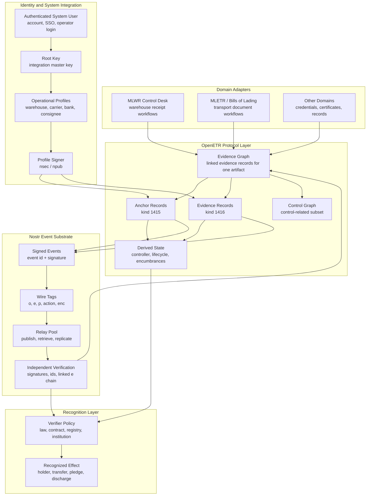

# OpenETR Evidence Graph Infographic

This infographic ties together the main OpenETR design idea:

> A cryptographically verifiable Evidence Graph forms the DCR. Defined rules
> derive Consequential State, while a Control Graph is the subset relevant to
> controller and control-transition consequences.

The Mermaid diagram below is the current editable source model.

```mermaid
flowchart TB
    subgraph Domain["Domain Adapters"]
        MLWR["MLWR Control Desk<br/>warehouse receipt workflows"]
        MLETR["MLETR / Bills of Lading<br/>transport document workflows"]
        OTHER["Other Domains<br/>credentials, certificates, records"]
    end

    subgraph Control["OpenETR Protocol Layer"]
        GRAPH["Evidence Graph<br/>linked evidence records for one artifact"]
        CONTROL_GRAPH["Control Graph<br/>control-related subset"]
        ORIGIN["Anchor Records<br/>kind 1415"]
        CONTROL_EVENTS["Evidence Records<br/>kind 1416"]
        STATE["Derived State<br/>controller, lifecycle, encumbrances"]
    end

    subgraph Nostr["Nostr Event Substrate"]
        EVENTS["Signed Events<br/>event id + signature"]
        TAGS["Wire Tags<br/>o, e, p, action, enc"]
        RELAYS["Relay Pool<br/>publish, retrieve, replicate"]
        VERIFY["Independent Verification<br/>signatures, ids, linked e chain"]
    end

    subgraph Identity["Identity and System Integration"]
        USER["Authenticated System User<br/>account, SSO, operator login"]
        ROOT["Root Key<br/>integration master key"]
        PROFILE["Operational Profiles<br/>warehouse, carrier, bank, consignee"]
        SIGNER["Profile Signer<br/>nsec / npub"]
    end

    subgraph Recognition["Recognition Layer"]
        POLICY["Verifier Policy<br/>law, contract, registry, institution"]
        EFFECT["Recognized Effect<br/>holder, transfer, pledge, discharge"]
    end

    MLWR --> GRAPH
    MLETR --> GRAPH
    OTHER --> GRAPH

    GRAPH --> ORIGIN
    GRAPH --> CONTROL_EVENTS
    GRAPH --> CONTROL_GRAPH
    ORIGIN --> STATE
    CONTROL_EVENTS --> STATE

    ORIGIN --> EVENTS
    CONTROL_EVENTS --> EVENTS
    EVENTS --> TAGS
    TAGS --> RELAYS
    RELAYS --> VERIFY
    VERIFY --> GRAPH

    USER --> ROOT
    ROOT --> PROFILE
    PROFILE --> SIGNER
    SIGNER --> ORIGIN
    SIGNER --> CONTROL_EVENTS

    STATE --> POLICY
    VERIFY --> POLICY
    POLICY --> EFFECT
```

## Reading The Diagram

The Evidence Graph is the object-centric DCR graph formed by an Anchor Record
and later linked Evidence Records. The Control Graph is the subset used to
derive controller or control-transition state.

The Digital Artifact can itself be a record, such as a warehouse receipt, bill
of lading, certificate, or credential. OpenETR keeps that artifact distinct from
the signed evidence records that concern it.

Nostr provides the event substrate below the graph:

- event ids bind the serialized event data
- signatures bind events to profile public keys
- tags provide object identity, participant references, and chain links
- relays provide open publication and retrieval
- verifiers can independently check the chain without trusting the original application

Domain adapters sit above the graph. They make OpenETR usable in specific domains without changing the generic protocol.

For example, the MLWR adapter can speak in terms of:

- create receipt evidence record
- transfer receipt
- pledge or restrict receipt
- release encumbrance
- present for delivery
- complete delivery

Those actions translate into generic OpenETR Anchor Events and later Evidence Events.

Identity and system integration sit beside the graph. An existing system may authenticate its own users however it already does, then use a root-and-profile model to connect those users to OpenETR signing profiles.

The root key is an integration and administration key. It can organize profile keys, recover configuration, and hide OpenETR key management behind an ordinary account-based system. Operational profiles then sign the actual OpenETR events.

The recognition layer is deliberately separate. The verified graph proves signed structure, provenance, and event history. The verifier's policy determines legal, institutional, contractual, or operational effect.

## Design Implication

OpenETR does not require all participants to share one application, database, registry, or legal policy.

Different systems can:

- publish and retrieve the same signed event graph
- verify the same Nostr wire-format evidence
- present domain-specific workflows through their own adapters
- connect authenticated users to profile signers through their own account systems
- apply their own recognition policy to determine effect

This is the core portability claim: the control evidence is shared and cryptographic, while the applications, domains, identities, and recognition rules can remain independently operated.
