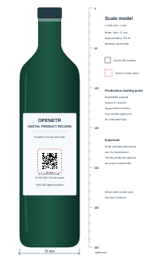

# OpenETR QR Production And Scratch-Off Design Note

## Status

Design note for review, prototyping, and production testing.

This note is non-normative. It supplements the
[OpenETR QR Resolver Profile 1.0](OPENETR_QR_RESOLVER_PROFILE_1_0.md) with
practical considerations for printing OpenETR resolver QR codes, especially
under removable scratch-off coatings on curved product labels such as wine
bottles.

## 1. Purpose

An OpenETR QR code may be technically valid but still perform poorly after it
is printed, coated, applied to a curved surface, scratched, exposed to moisture,
and scanned by an ordinary mobile device.

This note addresses the resulting production questions:

- how small an OpenETR QR code can reasonably be printed;
- how digest encoding affects QR density;
- how quiet zones and module size affect scanning;
- whether error-correction level M is sufficient for scratch-off use;
- whether decorative modules or logos should be used;
- how bottle curvature, coating, and residue affect the symbol; and
- what a concealed QR code can and cannot establish about a physical product.

The central production principle is:

> The smallest code that scans once is not the smallest code that should be
> manufactured.

## 2. Relationship To The QR Resolver Profile

The QR Resolver Profile separates:

1. the **Resolver Profile**, which determines dispatch and handling; and
2. the **Resolution Reference**, which either carries the Artifact Digest
   directly or resolves to it through a declared service.

The resulting **Artifact Digest** identifies the exact Digital Artifact. A
campaign identifier or unique label identifier remains a scoped Resolution
Reference and does not replace the digest as OpenETR artifact identity.

The complete printed resolver URL is a **Resource Locator**. A **Resource
Identifier** identifies a resource within its scheme; a **Resource Reference**
may contain an identifier, locators, or both. A locator can already contain an
identifier, so these need not be separate fields. The resolver base address
alone does not locate the specific artifact. See the
[formal terms and identity/location model](OPENETR_QR_RESOLVER_PROFILE_1_0.md#69-resource-identifier).

Changing a storage location need not change the artifact digest. Changing the
artifact bytes does. Durable printed labels therefore require both continued
resolution and preservation of the reference-to-digest binding; keeping a URL
online alone is not sufficient.

For ordinary mobile-device scanning, the Standard Web Resolver Profile uses:

```text
https://{resolver-authority}/etr/{artifact-digest}
```

Version 1 permits either:

- a 64-character lowercase hexadecimal SHA-256 digest; or
- a 43-character unpadded Base64URL encoding of the same 32-byte digest.

Both representations identify the same Digital Artifact. The Resolver
normalizes either representation to lowercase hexadecimal before performing
OpenETR object queries.

For direct resolution, the compact Base64URL representation is preferable
where the physical QR size is constrained. It reduces the payload without
introducing an opaque record identifier or changing the underlying digest.

An indirect campaign profile may instead carry a short campaign-scoped URL.
The campaign resolver then returns the digest and applies declared routing or
presentation rules.

## 3. Reference Payload

This note uses the following digest from a live public OpenETR example:

```text
72f268d79dc36412a21d046cc2124b9ca02aab3c712eb23e67fd96d86a38e38f
```

Its equivalent unpadded Base64URL encoding is:

```text
cvJo153DZBKiHQRswhJLnKAqqzxxLrI-Z_2W2Go4448
```

Using `openetr.org` as the Resolver Authority produces these payloads:

```text
https://openetr.org/etr/72f268d79dc36412a21d046cc2124b9ca02aab3c712eb23e67fd96d86a38e38f
```

```text
https://openetr.org/etr/cvJo153DZBKiHQRswhJLnKAqqzxxLrI-Z_2W2Go4448
```

Both URLs resolve to the same
[live record](https://openetr.org/etr/cvJo153DZBKiHQRswhJLnKAqqzxxLrI-Z_2W2Go4448)
and are normalized to the hexadecimal digest before OpenETR evidence is
queried.

The hexadecimal URL contains 88 characters. The Base64URL form contains 67
characters.

## 4. QR Geometry

### 4.1 Module Counts

At common QR error-correction levels, the reference payloads produce the
following symbols with the current Python `qrcode` encoder:

| Digest encoding | Error correction | QR version | Active modules | Modules including four-module quiet zone |
| --- | --- | ---: | ---: | ---: |
| Hexadecimal | L | 5 | 37 x 37 | 45 x 45 |
| Hexadecimal | M | 6 | 41 x 41 | 49 x 49 |
| Hexadecimal | Q | 8 | 49 x 49 | 57 x 57 |
| Hexadecimal | H | 9 | 53 x 53 | 61 x 61 |
| Base64URL | L | 4 | 33 x 33 | 41 x 41 |
| Base64URL | M | 5 | 37 x 37 | 45 x 45 |
| Base64URL | Q | 6 | 41 x 41 | 49 x 49 |
| Base64URL | H | 8 | 49 x 49 | 57 x 57 |

The Base64URL representation saves one QR version at each listed correction
level for this payload. Exact versions remain dependent on the Resolver
Authority, path, digest, encoder, and error-correction setting.

### 4.2 Physical Size

Physical width is calculated as:

```text
(active modules + quiet-zone modules) x module size
```

For the Base64URL Version 5-M symbol:

| Printed module size | Active symbol | Complete footprint including quiet zone |
| ---: | ---: | ---: |
| 0.50 mm | 18.5 mm | 22.5 mm |
| 0.45 mm | 16.7 mm | 20.3 mm |
| 0.40 mm | 14.8 mm | 18.0 mm |
| 0.33 mm | 12.2 mm | 14.9 mm |

The table gives mathematical dimensions, not a guarantee of scan performance.
Smaller modules are less tolerant of dot gain, registration error, surface
damage, camera focus, glare, and residue.

### 4.3 Quiet Zone

A quiet zone of at least four modules shall remain clear on every side of the
symbol. The quiet zone is part of the production footprint even though it does
not contain encoded modules.

No text, border, illustration, varnish transition, cut line, scratch-panel
edge, or label artwork should intrude into it. The revealed surface should
provide a continuous light background throughout the quiet zone.

## 5. Recommended Production Sizes

### 5.1 General Printed Use

For clean, flat, high-quality printed material, a Base64URL Version 5-M symbol
may be prototyped at a complete footprint of approximately 18 to 20 mm. This
range should not be adopted for production without testing the actual printing
process and representative mobile devices.

### 5.2 Scratch-Off Bottle Labels

For a scratch-off QR code on a wine bottle, the recommended starting point is:

```text
QR payload       Standard Web Resolver Profile with Base64URL digest
Error correction M
QR footprint     22 to 25 mm, including quiet zone
Scratch panel    approximately 27 to 30 mm
Modules          solid black squares
Background       matte white
Logo             none inside the symbol
```

A 24 mm complete Version 5-M footprint provides a module size of approximately
0.53 mm. This is a useful starting balance between label area and scanning
margin.



**Figure 1. Representative bottle and QR scale.** The illustration uses one
SVG unit per millimetre. The bottle is modelled at 300 mm high by 75 mm wide,
the revealed QR footprint is 24 mm, and the indicated scratch panel is 30 mm.
The image may be scaled by a viewer, but the relative dimensions remain exact.
Actual 750 ml bottle and label dimensions vary by manufacturer.

An 18 mm footprint should be treated as an aggressive lower boundary for this
use case. A footprint near 15 mm may scan under controlled conditions but is
not recommended for a consumer-facing scratch-off label.

These recommendations are starting points, not universal minimums. Production
approval should depend on measured scan performance after printing, coating,
application, conditioning, and consumer-style removal.

## 6. Scratch-Off Construction

### 6.1 Layering

The QR code should be printed on the permanent label substrate beneath an
opaque removable coating. It should not be printed on the removable coating.

A representative layer sequence is:

```text
removable opaque scratch coating
release layer compatible with the printing system
black QR symbol and white quiet-zone background
permanent product label
bottle surface
```

The coating and release layer should be selected as a tested system. Poorly
matched materials can remove ink, leave adhesive, polish the substrate to a
reflective surface, or leave residue that closes the light spaces between
modules.

### 6.2 Scratch Panel Size

The scratch panel should extend beyond the complete QR footprint so that its
edge does not become a false border or intrude into the quiet zone. A margin of
approximately 2 to 3 mm on each side is a reasonable prototype starting point.

The panel should include enough space for a concise instruction without
placing that instruction inside the revealed quiet zone.

### 6.3 Surface And Contrast

The revealed surface should be:

- high contrast;
- matte rather than glossy;
- resistant to smearing;
- resistant to ordinary condensation and handling; and
- free of metallic residue over the symbol.

Black modules on a white background provide the greatest conventional scanning
margin. Metallic inks, reverse-polarity symbols, transparent substrates,
gradients, and low-contrast brand colours should be avoided for the concealed
production symbol.

## 7. Bottle And Label Geometry

A cylindrical bottle curves the QR code away from the camera. The effect is
most significant across the horizontal dimension of the symbol.

Production placement should:

- use the flattest available portion of the label panel;
- avoid the bottle shoulder and base transition;
- avoid the label seam and areas likely to wrinkle;
- avoid highly reflective glass or foil immediately around the symbol;
- keep the scratch panel within a visually continuous front-facing area; and
- preserve enough surrounding space for the phone camera to focus.

The code should be tested after the label has been applied to the actual bottle,
not only as a flat press proof.

## 8. Error Correction

The QR Resolver Profile 1.0 specifies level M, which provides approximately 15
percent codeword restoration under the QR error-correction model. The compact
reference payload produces a Version 5-M symbol.

Scratch-off production creates a plausible case for also testing level Q:

- level M uses fewer, larger modules at a given physical footprint;
- level Q provides greater damage recovery but increases the reference payload
  to Version 6; and
- scratches and residue may create concentrated rather than evenly distributed
  damage.

For a controlled pilot, compare at least:

| Candidate | Suggested complete footprint | Purpose |
| --- | ---: | --- |
| Base64URL Version 5-M | 22 to 25 mm | Current profile and larger modules |
| Base64URL Version 6-Q | 24 to 27 mm | Greater damage tolerance |

If Q materially improves field performance, the QR Resolver Profile may need a
named scratch-off production variant. A production implementation should not
silently describe a Q symbol as conforming to a profile that normatively
requires M.

## 9. Module Styling And Branding

The installed QR library can render square, gapped-square, rounded, or circular
modules. It can also apply colours, gradients, and embedded images.

Those capabilities should not be confused with production suitability.

For scratch-off labels at the lower end of the size range:

- use solid square modules;
- keep the finder patterns square and unobstructed;
- do not use circular or gapped modules;
- do not use gradients;
- do not place a logo inside the symbol; and
- place branding beside the scratch panel instead.

Dots and rounded modules may be evaluated for larger visible QR codes, but they
consume scanning margin that is more valuable after a scratch coating has been
removed.

## 10. Print Resolution And Artwork

Production artwork should be generated as vector output where possible. Raster
output should:

- use an integer number of printer dots per QR module;
- avoid antialiasing;
- avoid image resampling after generation;
- preserve exact square geometry; and
- be generated at the final physical dimensions.

DENSO WAVE recommends at least four printer dots per module as a printing
baseline. For this use case, the intended module sizes and a 600 dpi production
process should normally provide substantially more than four dots per module.

The printer should inspect for dot gain that closes light gaps and for dropout
that breaks dark modules. A high nominal printer resolution does not compensate
for poor ink, substrate, coating, or finishing behaviour.

## 11. Verification And Acceptance Testing

### 11.1 Test Articles

Testing should use production-representative:

- labels;
- inks and underprint;
- release layers and scratch coatings;
- bottle materials, colour, and geometry;
- application equipment;
- finishing and varnish processes; and
- environmental conditioning.

A PDF proof or office-printer sample is not sufficient for production approval.

### 11.2 Device Matrix

The test matrix should include:

- current and older iOS devices;
- current and older Android devices;
- default camera applications;
- the Safebox Web or other custom handler, where applicable;
- bright retail lighting;
- dim indoor lighting;
- glare and angled viewing;
- dry and condensation-exposed bottles; and
- cleanly and poorly scratched samples.

### 11.3 Damage Conditions

Samples should be evaluated after:

- complete clean removal;
- incomplete edge removal;
- residual coating across data modules;
- fingernail scratching;
- coin scratching;
- light abrasion during shipping;
- label scuffing;
- moisture exposure; and
- ordinary handling contamination.

### 11.4 Acceptance Criteria

Before production, the project should define measurable acceptance criteria,
including:

- first-attempt scan rate;
- maximum acceptable scan time;
- supported device range;
- supported viewing distance and angle;
- acceptable percentage of residual coating;
- correct extraction of both permitted digest encodings;
- correct resolver response for valid, unknown, and malformed digests; and
- absence of false claims when no OpenETR evidence is retrieved.

A candidate should be enlarged or otherwise revised if it only succeeds after
repeated repositioning, manual camera zoom, unusually bright lighting, or
complete laboratory-quality cleaning.

## 12. GS1 And Other 2D Carrier Standards

### 12.1 Carrier And Payload Are Separate Layers

QR Code, Data Matrix, Aztec, and PDF417 are machine-readable carriers. They
define how characters or bytes are rendered and acquired. They do not, by
themselves, determine what the encoded payload means.

Domain standards add that meaning. For example:

- GS1 defines product and supply-chain identifiers, Application Identifiers,
  GS1 element strings, and GS1 Digital Link URI syntax;
- IATA defines the structured payload of a Bar Coded Boarding Pass; and
- OpenETR defines a Resolver Profile and Artifact Digest used to discover
  evidence concerning a Digital Artifact.

Encoding an OpenETR resolver URL in an Aztec or Data Matrix symbol would not
make it an IATA or GS1 record. Conversely, displaying a GS1 Digital Link URI as
a QR code does not make the QR symbology itself specific to GS1.

The architectural distinction is:

```text
machine-readable carrier
  -> acquisition and decoding

payload profile
  -> structure and dispatch

identifier and domain rules
  -> meaning, verification, and effect
```

### 12.2 When GS1 Is Relevant

GS1 is relevant where the product label must participate in processes such as:

- retail point-of-sale scanning;
- GTIN-based product identification;
- batch, lot, serial, or expiry processing;
- recalls and supply-chain traceability;
- inventory management; or
- standardized product-information discovery.

GS1 Sunrise 2027 encourages retail systems to accept 2D barcodes carrying GS1
identifiers, especially the GTIN, at point of sale. It does not mean that every
QR code printed on a product must use a GS1 payload.

The Standard Web Resolver Profile URL:

```text
https://openetr.org/etr/{artifact-digest}
```

is a valid QR payload, but it is not a GS1 Digital Link. It identifies a
Digital Artifact using an OpenETR digest rather than identifying a trade item,
location, asset, or other entity using a GS1 primary identification key.

### 12.3 Assigned Identifiers And Values

GS1 standardizes the syntax and meanings of its Application Identifiers. For
example:

- `01` identifies a GTIN;
- `10` identifies a batch or lot;
- `17` identifies an expiration date; and
- `21` identifies a serial number.

GS1 does not centrally assign every value appearing in a barcode. A business
obtains the appropriate GS1 identification capacity and assigns product,
batch, or serial values according to the applicable GS1 rules. The Application
Identifiers allow other systems to interpret those values consistently.

A serialized GS1 Digital Link might use this form:

```text
https://example.wine/01/{14-digit-gtin}/21/{serial-number}
```

A conforming GS1 Digital Link includes a GS1 primary identification key in its
path. An OpenETR digest is not a substitute for that key.

### 12.4 Possible GS1 Integration Patterns

#### Separate Carriers

The simplest pattern is:

```text
visible GS1 EAN/UPC or GS1 Digital Link
  -> product identity, inventory, and checkout

concealed OpenETR QR
  -> bottle-specific artifact digest and signed evidence
```

This pattern keeps the standards boundaries clear and allows each code to be
optimized for its own scanners and operating conditions.

It is particularly appropriate for a scratch-off implementation. A concealed
code cannot serve as the point-of-sale barcode before purchase, and keeping it
separate prevents a retail scanner from selecting the OpenETR QR when it
expects a GTIN.

#### GS1 Digital Link Resolver Association

A GS1 Digital Link may identify the bottle using a GTIN and serial number. A
GS1-conformant resolver may then offer multiple related resources, including a
link to an OpenETR resolver URL:

```text
GS1 Digital Link
  -> identifies the bottle
  -> resolver links to:
       product information
       traceability information
       OpenETR evidence lookup
```

This can provide a single visible entry point. It also means that discovery of
the OpenETR digest may depend on the GS1 resolver continuing to publish the
association. Encoding the digest directly in the concealed OpenETR QR
preserves greater resolver independence.

#### GS1 Extension Parameter

GS1 Digital Link permits arbitrary query-string extension parameters when the
parameter key is not entirely numeric and the data cannot already be expressed
using a GS1 Application Identifier. A deployment could therefore evaluate a
form such as:

```text
https://example.wine/01/{gtin}/21/{serial}?openetr={base64url-digest}
```

This approach should not be adopted without GS1 validation and production
scanner testing. It creates a longer and denser symbol, combines two identifier
systems in one payload, and may interact differently with retail, resolver,
and consumer applications. The OpenETR digest remains an extension value; it
does not become the GS1 primary identification key.

### 12.5 Boarding-Pass Comparison

Boarding-pass systems illustrate the same distinction. Aztec, QR Code, and
PDF417 can act as carriers. The IATA Bar Coded Boarding Pass standard defines a
specific structured payload interpreted by airline and airport systems.

An OpenETR resolver URL could technically be rendered as an Aztec symbol, but
that would not make the payload an IATA boarding pass. It would remain an
OpenETR resolver payload using a different acquisition technology.

### 12.6 OpenETR Design Consequence

No change to the OpenETR evidence protocol, Artifact Digest, Anchor Event, or
Core Record Ruleset is required to support another carrier.

The presentation architecture can be understood as:

```text
Artifact Digest
  + Resolver Profile
  + Machine-Readable Carrier
```

The current standardized carrier is QR Code Model 2. Future presentation
profiles may use Data Matrix, Aztec, NFC, a GS1 Digital Link association, or
another acquisition mechanism while preserving the same digest and evidence
semantics.

For the initial wine-bottle scratch-off pilot, this note recommends retaining
the compact OpenETR QR beneath the scratch panel and treating GS1 identification
as a parallel visible retail layer.

## 13. Campaign And Unique-Label Resolution

### 13.1 Existing Campaign URL Structures

A physical-label platform may already assign one unique URL to every label. A
representative campaign structure is:

```text
https://example.com/{campaign-id}/{individual-unique-link-id}
```

This structure is compatible with OpenETR through an indirect campaign
Resolver Profile. The campaign and unique-link identifiers locate the label
record. The campaign resolver maps that record to the applicable Artifact
Digest.

These identifiers are assigned and governed by the campaign platform. They do
not need to be GS1-assigned values unless the deployment separately chooses to
encode a GS1-conformant payload.

The QR carrier does not need to understand OpenETR, the campaign, or the
event-evaluation rules. It only carries the URL.

### 13.2 Resolution Flow

The recommended flow is:

```text
physical campaign label
  -> campaign URL
  -> validate campaign and unique-link reference
  -> resolve stable label-to-digest binding
  -> expose or redirect to canonical OpenETR digest URL
  -> retrieve and verify signed evidence
  -> apply identified OpenETR ruleset
  -> apply campaign-specific rules
  -> render the resulting experience
```

The flow has two distinct rule boundaries:

```text
OpenETR ruleset
  -> evaluates signed evidence concerning the digest

campaign rulebook
  -> determines registration, rewards, presentation, transfer workflow,
     eligibility, redemption, and other campaign consequences
```

The campaign rulebook may rely on OpenETR results, but it should not present an
application decision as though it were a conclusion produced by the OpenETR
protocol.

### 13.3 Stable Binding And Dynamic Campaign Rules

The resolver may change the user experience without changing the printed QR
code. For example, the same label URL may present:

- pre-release product information;
- post-purchase verification;
- registration or activation;
- a points claim;
- a transfer workflow;
- redemption status; or
- a warning after recall, cancellation, or suspicious duplicate use.

That flexibility should not make artifact identity mutable. Once a physical
label is distributed, its mapping to the Artifact Digest should remain stable.
A correction or supersession should preserve the earlier binding and expose
auditable evidence of what changed.

Where durable independent verification matters, the campaign operator should
publish a signed binding containing at least:

- the campaign reference;
- the unique physical-label reference;
- the Artifact Digest;
- the binding issuer;
- the binding time or claimed effective time; and
- any replacement or supersession relationship.

The binding format remains an implementation and protocol-design question. It
could be represented as signed OpenETR linked evidence without placing the
campaign identifiers in the Anchor Event itself.

### 13.4 Verification, Ownership, And Points

An OpenETR integration could support several different campaign concerns, but
their meanings should remain separate.

| Concern | OpenETR contribution | Campaign or domain responsibility |
| --- | --- | --- |
| Product verification | Resolve the digest, verify Anchor and Evidence Events, and report derived state | Decide which publishers and results are recognized for the product |
| Digital ownership | Preserve signed evidence relevant to a claimed control or transfer history | Authenticate users and define what ownership means and how it is transferred |
| Transferable points | Preserve attributable issuance or transfer evidence under a future profile | Define balances, eligibility, transfer, expiry, redemption, fraud controls, and consumer terms |

OpenETR Core Record Ruleset 1.0 does not establish legal ownership, Current
Controller, or transferable-points balances. Those conclusions require an
identified extension ruleset and an external recognition policy. A scan alone
should not be treated as proof of ownership.

### 13.5 Direct, Indirect, And Hybrid Choices

| Pattern | Benefit | Limitation |
| --- | --- | --- |
| Direct OpenETR digest URL | Maximum portability and independent resolution | Does not directly carry campaign routing identifiers |
| Campaign URL resolving to digest | Fits an existing campaign system and allows dynamic experiences | Depends on the campaign resolver until the digest is disclosed |
| Campaign URL plus signed digest binding | Combines campaign flexibility with auditable artifact identity | Requires binding publication and verification support |

For campaign-managed labels, the third pattern is the preferred long-term model:
keep the existing campaign URL, resolve it to a stable digest, expose a
canonical direct OpenETR link, and provide a signed binding where the assurance
case requires one.

### 13.6 Privacy And Bearer-Capability Considerations

A unique campaign link under a scratch panel may be more than a locator. If
first possession or first use can register an account, award points, transfer a
benefit, or redeem value, it functions as a bearer capability.

The campaign system should therefore consider:

- link entropy and resistance to guessing;
- pre-activation theft or photography;
- replay and duplicate scans;
- user authentication before consequential actions;
- consent before account binding;
- recovery and dispute processes;
- scan telemetry and location privacy; and
- separation between public verification and private reward claims.

The Artifact Digest itself remains a public identifier and should not be used
as the secret authorizing a campaign consequence.

## 14. Security And Product Claims

### 14.1 What The Scratch Layer Provides

A scratch layer can provide:

- concealment before purchase or use;
- visible evidence that the panel has been opened;
- a deliberate consumer interaction; and
- some resistance to casual pre-purchase scanning.

### 14.2 What It Does Not Provide

A scratch layer does not make the QR code unclonable. A QR payload may be
copied before coating, during production, after legitimate reveal, or from a
photograph.

The Artifact Digest is an identifier, not a password or bearer secret. It
should not be treated as confidential authorization merely because it appears
under a scratch panel.

Scanning a valid OpenETR resolver URL does not, by itself, prove:

- that the label is attached to the intended bottle;
- that the bottle contents are genuine;
- that the QR code has not been copied;
- that the scanner is the first purchaser;
- that the product has not been refilled or substituted; or
- that a retrieved Anchor Event is recognized by the relying party.

### 14.3 Bottle-Specific Records

If the use case includes anti-counterfeiting, activation, or first-purchaser
interaction, each bottle should use a bottle-specific Digital Artifact and
digest. Reusing one digest across a product run makes every printed QR
interchangeable.

A stronger system may combine:

- a unique bottle-specific artifact;
- issuer-signed OpenETR evidence;
- a physical tamper-evident label;
- controlled production and serialization;
- a signed activation or redemption notice; and
- a recognition policy that states what duplicate or later scans mean.

Even this combination does not create universal consensus or make a physical
object cryptographically unclonable. It provides evidence that a verifier can
evaluate under an identified rulebook.

## 15. Initial Pilot Recommendation

The recommended initial wine-bottle pilot is:

```text
Resolver profile     openetr:qr-resolver:https:1.0
Digest encoding      unpadded Base64URL
Error correction     M
QR footprint         24 mm including quiet zone
Scratch panel        27 to 30 mm
Module style         solid black squares
Background           matte white
Embedded logo        none
Artwork              vector preferred
Production output    600 dpi or better where rasterization occurs
Record strategy      one bottle-specific digest where individualization matters
```

The pilot should also include a 25 to 27 mm level-Q comparison sample to
determine whether greater damage recovery offsets its denser module matrix.

No production minimum should be adopted until the complete label system passes
the acceptance tests described in Section 11.

## 16. Open Design Questions

1. Should QR Resolver Profile 1.0 permit both M and Q, or should Q be defined in
   a separate scratch-off production profile?
2. Does the product use case require one digest per product type, batch, case,
   or individual bottle?
3. Is the scratch panel intended for concealment, tamper evidence, consumer
   engagement, activation, anti-counterfeiting, or a combination?
4. Should a custom application Resolver Profile provide an additional compact
   payload, and what happens when the application is not installed?
5. What signed evidence, if any, should follow first reveal, activation, or
   redemption?
6. What recognition policy governs duplicate, delayed, or offline scans?
7. Should the campaign-to-digest binding use an existing OpenETR linked
   evidence shape or a dedicated evidence profile?
8. Which campaign actions are presentation decisions, and which should produce
   signed evidence for later independent verification?

## 17. References

- [OpenETR QR Resolver Profile 1.0](OPENETR_QR_RESOLVER_PROFILE_1_0.md)
- [OpenETR Core Record Ruleset 1.0](OPENETR_CORE_RECORD_RULESET_1_0.md)
- [DENSO WAVE: QR Code Versions And Module Counts](https://www.qrcode.com/en/about/version.html)
- [DENSO WAVE: QR Code Error Correction](https://www.qrcode.com/en/about/error_correction.html)
- [DENSO WAVE: QR Code Quiet Zone](https://www.qrcode.com/en/howto/code.html)
- [DENSO WAVE: QR Code Module Size](https://www.qrcode.com/en/howto/cell.html)
- [GS1 Digital Link URI Syntax](https://ref.gs1.org/standards/digital-link/uri-syntax/)
- [GS1-Conformant Resolver Standard](https://ref.gs1.org/standards/resolver/)
- [GS1 US: Sunrise 2027](https://www.gs1us.org/industries-and-insights/by-topic/sunrise-2027)
