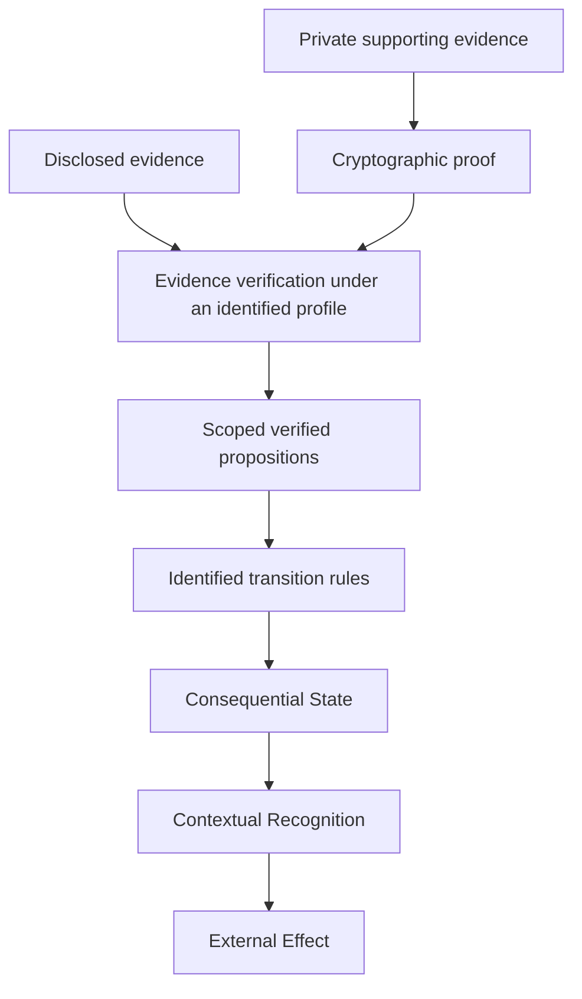

# Private Evidence And Verified Propositions

## Status And Decision

Design note and future profile direction. This note clarifies the evidence
model; it does not introduce an event kind, wire-format object, proof system,
or implemented private-state verifier. Existing Core Record Ruleset 1.0 and
Nostr event-validation requirements continue to apply.

**Independent verification does not imply full disclosure.** Consequential
State is independently derived from sufficient verifiable evidence under
identified rules. A future profile may permit a required proposition to be
established through disclosed evidence or an accepted privacy-preserving proof.

The control layer remains central: control consequences follow from evaluating
evidence under the applicable control rules. Recognition and external effect
remain separate decisions. No mint, bearer credential, or authoritative
spent-state database is introduced by this refinement.

## External History And Exact Bytes

**Artifacts carry content. Evidence carries history. Rules derive consequence.**

In OpenETR, the **proof is outside the artifact**. A Digital Artifact need not
contain OpenETR metadata, controller information, or its own history. External
DCR evidence refers to the artifact by digest; the artifact need not refer
back to that evidence.

Byte identity is the concept; digest is the mechanism. In the current binding,
artifact identification checks `SHA-256(candidate_bytes) == object_digest`.
This establishes exact-byte correspondence under the hash assumptions, not
semantic meaning, authority, or recognition. Identification does not require
parsing a PDF, image, credential, or future format.

The base protocol performs no implicit normalization, metadata stripping, or
payload extraction. A profile must identify the exact bytes it treats as the
artifact. A transformed representation is a different artifact if its bytes
differ; relationships such as `derived-from`, `representation-of`, `replaces`,
or `supersedes` require evidence and defined profile semantics. These examples
do not register new base actions or tags.

## Evidence And Disclosure

**Verifiable evidence** is evidence sufficient for an independent verifier to
establish the propositions required by the applicable rules. The underlying
information need not necessarily be fully disclosed.

Private source material alone is not independently verifiable by a party that
cannot inspect it. That party needs an accepted proof or other evidence with
a defined scope. Encryption controls access; a hash binds bytes; neither alone
proves that hidden content satisfies a mandate, eligibility, or transfer rule.

Three access questions are distinct: access to the artifact, access to the
underlying supporting evidence, and access to the material needed to verify a
proof. Independent verification need not mean public publication. Authorized
verifiers may exchange evidence privately, subject to availability and policy.

## Verified Propositions

A **verified proposition** is a scoped conclusion established by checking
evidence with an identified verification procedure. It is a conceptual
interface between evidence verification and transition evaluation, not a new
wire-format object or a universally true claim.

A future adapter should preserve the proposition, artifact and event binding,
subject and action, relevant time or graph cut, evidence references, procedure
and version, public inputs, assumptions, and outcome. A bare `true` supplied
by an application is not enough to reproduce the verification.

| Required proposition | Possible mechanism under an explicit profile | Limit |
| --- | --- | --- |
| A key authorized this action | Disclosed signed action or proof bound to the action and key | Key attribution does not establish institutional authority |
| A qualifying mandate covered the action at the relevant time | Disclosed signed mandate or proof of qualifying scope and validity | Issuer authority, revocation scope, and temporal assurance still need rules |
| The recipient accepted this transfer | Signed acceptance or an accepted proof of that acceptance | A generic credential-possession proof does not establish consent to this transfer |
| No blocking encumbrance exists in the required scope | Evidence or a non-membership proof over a defined, authenticated state commitment | Absence from a partial relay response cannot establish global absence |

These are illustrative predicates, not additions to the baseline transfer
rules. In particular, this note does not make recipient acceptance mandatory
in profiles that currently use another transfer model.

**Rules define what must be proven, not necessarily what must be revealed.**
The ruleset identifies the required propositions and acceptable evidence
profile. The profile specifies how to establish them, including trust roots,
proof verification, context binding, freshness, and failure handling. Two
mechanisms are interchangeable only if they establish the required proposition
with the assurance that the rules require. An institutional attestation proves
that an institution made a statement; accepting its substance introduces that
institution as a trust dependency.

Missing material, unsupported proof mechanisms, failed proof checks, and a
verified negative proposition are distinct outcomes. A future verifier must
not silently treat the first three as successful proof or as proof that the
underlying proposition is false. If a required proposition remains unresolved,
report insufficient evidence or an indeterminate result under the rules.

## Durability And Historical Derivation

**Durability of verification does not require durability of disclosure.** It
does require preservation of sufficient verification material and assumptions.
A historical verification package may need:

- the proof, public inputs, commitments, and binding to the artifact and event;
- the proof-system, circuit, verification-key, and parameter versions;
- the evidence profile and transition ruleset identifiers and versions;
- issuer, mandate, registry, or revocation evidence applicable to that scope;
- Temporal Proofs, where required, and the provenance of relevant checkpoints;
- retrieval scope, known conflicts, and unresolved dependencies.

A mutable URL to a verifier service is not a durable substitute for that
package. A signed service verdict is evidence of the service's assertion; it
does not let a recipient independently repeat the underlying proof check.

Retain the existing conceptual `derive_state(evidence, rules, at_event=E)`
boundary. A proof generated today about an earlier event does not by itself
prove that the proof existed then. Time-based claims require explicit temporal
semantics and evidence; signed event timestamps do not supply trusted time or
a total order. Future checks remain subject to availability and the continuing
adequacy of cryptographic assumptions.

## Determinacy And Coverage

Multiple authentic assertions may concern the same digest. OpenETR does not
require uniqueness of assertion. It aims for reproducible consequence given
the same evidence, identified rules and versions, evaluation parameters, and
verification dependencies. A deterministic result may be conflict, ambiguity,
or insufficient evidence rather than one controller.

Different disclosed subsets may produce different results. Each result must
identify its evidence scope; no hidden or omitted history is presumed absent.
A non-membership proof establishes absence only within its committed set. Rules
must separately establish why that set has the required coverage, authority,
and freshness. Privacy-preserving proofs do not solve equivocation or global
completeness on their own.

## Threat And Privacy Considerations

| Risk | Required design response for a future profile |
| --- | --- |
| Replaying a proof for another artifact, transfer, or ruleset | Bind the statement to the relevant digest, event, action, participants, and profile; define challenge or freshness requirements where needed |
| Hiding a revocation, conflicting branch, or encumbrance | Specify retrieval coverage, authenticated checkpoints, and conflict rules; preserve unknown completeness |
| Proving the wrong statement with a valid proof | Identify the exact predicate, circuit, public inputs, and verification parameters; review their correspondence to the rule |
| Substituting untrusted verification keys or setup material | Authenticate and version dependencies; state setup and trust assumptions |
| Losing historical proof dependencies | Archive the verification package and identify unavailable dependencies in results |
| Correlating private activity | Assess exposed digests, public keys, graph links, timestamps, proof inputs, and repeated presentations |
| Guessing sensitive artifact contents | Treat an unsalted artifact digest as an equality handle, not a hiding commitment; predictable candidate files can be hashed and tested |
| Disclosing private records through storage or logs | Minimize published content and enforce access and retention policy in the hosting application |

Hiding a witness does not hide the public Nostr event graph. The current event
shape exposes signing keys and graph references to event recipients. Private
controller continuity therefore needs a separately reviewed profile and may
need a new representation; it cannot be promised by attaching a proof to an
otherwise identifying event. A privacy commitment, if introduced by a profile,
must be distinguished from the unchanged exact-byte artifact digest.

## Implementation Direction

Keep ZK and selective-disclosure mechanisms optional. First specify a bounded
profile, for example mandate-scope verification, and the evidence-to-proposition
interface. Review binding, revocation, completeness, and historical replay;
then implement an adapter and independent verification tests. The library,
REST API, web app, and CLI should use the same component result when supported.

This note does not authorize current software to bypass required signed events,
accept opaque proofs as validated evidence, or claim private controller support.
It refines the architectural extension point while preserving the DCR and
control model.

## Related Documents

- [Consequential State Architecture](CONSEQUENTIAL_STATE_ARCHITECTURE_DESIGN_NOTE.md)
- [Generic Verifier Policy](OPENETR_GENERIC_VERIFIER_POLICY.md)
- [Generic Transfer Model](OPENETR_GENERIC_TRANSFER_MODEL.md)
- [ZK-SNARKs And Hash Commitments](ZK_SNARKS_AND_HASH_COMMITMENTS_DESIGN_NOTE.md)
- [Roadmap](OPENETR_ROADMAP.md)
- [Policy Brief: Independent Verification Without Full Disclosure](../../docs-site/policy-briefs/independent-verification-without-full-disclosure.md)
