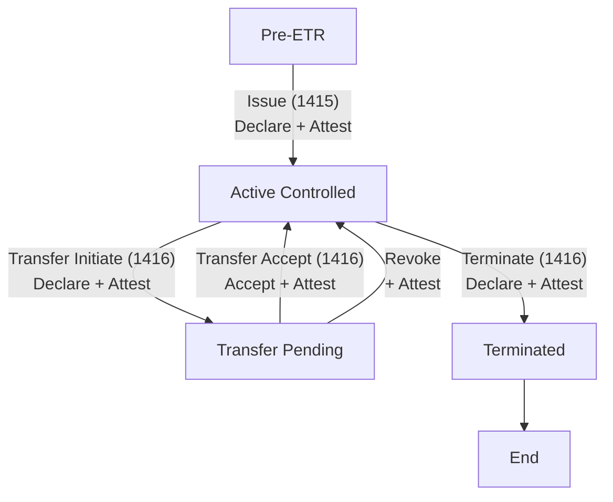

# State Transition

```mermaid
flowchart TD

    A["Pre-ETR"] -->|"Issue (1415)<br>Declare + Attest"| B["Active Controlled"]

    B -->|"Transfer Initiate (1416)<br>Declare + Attest"| C["Transfer Pending"]

    C -->|"Transfer Accept (1416)<br>Accept + Attest"| B

    C -->|"Revoke<br>+ Attest"| B

    B -->|"Terminate (1416)<br>Declare + Attest"| D["Terminated"]

    D --> E["End"]
```
