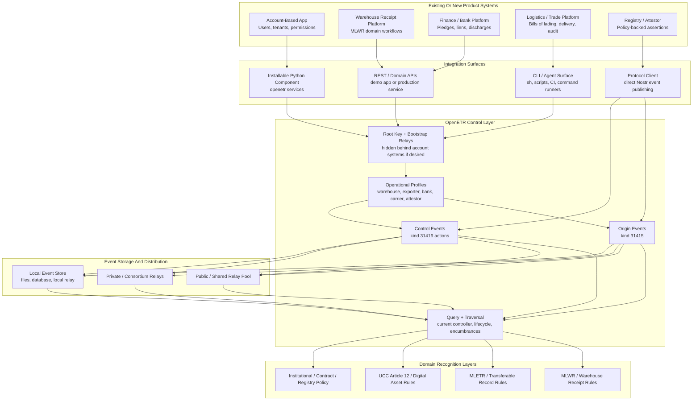

# System Integration Considerations

This note describes how OpenETR is intended to be integrated into existing or new systems that are independent of one another.

The core design assumption is that OpenETR state should not require one central application, database, or platform boundary. Operational state and transferable-record evidence can be relay-backed, signed, queryable, and portable across implementations.

## Status

Draft.

This note reflects the current relay-backed configuration model, OpenETR Nostr wire format, CLI, reusable service layer, and demonstration FastAPI application.

## Integration Thesis

OpenETR is intended to support multiple independent integration styles:

- an existing account-based application can hide the OpenETR bootstrap details behind its own login and account model;
- an existing Python system can import the installable `openetr` component directly;
- an automation system or agent can execute the `openetr` CLI from a shell-oriented workflow;
- a service can expose OpenETR behavior through REST-style APIs similar to the demonstration app;
- an integrator can bypass the demonstration app entirely and publish/query OpenETR events directly at the Nostr protocol layer;
- independent systems can interoperate if they follow the OpenETR wire format and use compatible relay and recognition policies.

The important point is that OpenETR does not require every participant to use the same application.

## Component And Service Boundary

OpenETR should be understood as a reusable control-layer component with multiple adapters.

The reference web app and CLI are important, but they are not separate sources of truth. Human pages, REST APIs, human CLI commands, and agent-oriented CLI commands should all route through the same OpenETR object/service layer wherever practical.

The intended shape is:

```text
human web pages
REST/API callers
human CLI commands
agent CLI commands with --json
embedded host application runtime
        ↓
openetr component / service layer
        ↓
canonical object and participant identifiers
baseline or custom guard policy
signed event construction and publication
query, traversal, verification, and structured results
```

This lets humans and agents use different interaction modes without changing the underlying OpenETR behavior.

The web app's REST APIs and the CLI's `--json` mode are the two primary machine-facing surfaces in the reference implementation:

- REST APIs are appropriate when another service wants to call a running OpenETR instance over HTTP.
- CLI `--json` is appropriate when an agent, script, CI job, shell workflow, or command runner wants structured input/output without a browser.

Both modes should return structured success, warning, confirmation-required, and error responses so automated callers do not need to parse human prose.

## Application-Level Recognition Policies

OpenETR deliberately separates protocol-level control evidence from application-level recognition policy.

The base protocol can show that a particular `npub` signed a particular origin or control event for a particular object digest. It can also expose profile metadata, known-entity records, attestations, relay evidence, and control-graph traversal.

It does not, by itself, decide whether that `npub` satisfies a particular system's KYC, AML, sanctions, customer onboarding, registry, licensing, contractual, or jurisdictional requirements.

Those checks belong to the integrating system, verifier policy, or domain adapter.

This is similar to TCP/IP: the network protocol supports many application protocols without enforcing each application's business rules. OpenETR should support KYC-sensitive and non-KYC-sensitive applications without making one application-level policy mandatory for every OpenETR event.

An integrating system may still use OpenETR evidence to support KYC-aware workflows. For example, a system may:

- require a recognized KYC attestation before accepting a profile as an issuer, controller, transferee, secured party, or obligor;
- consult a trust registry, enterprise account system, regulator, platform database, or KYC provider;
- publish or consume OpenETR `attest` events that associate an `npub` with a recognition claim;
- treat missing KYC evidence as a warning, manual-review condition, or policy block;
- expose KYC status in API or JSON responses without altering the underlying signed event graph.

In this model:

- OpenETR authenticates control events.
- KYC systems recognize actors.
- Verifier policy decides whether recognition is sufficient.

This keeps OpenETR general and jurisdiction-neutral while allowing regulated systems to impose the actor-recognition rules they need.

The same boundary applies to privacy-preserving proof systems such as ZK-SNARKs. OpenETR does not require ZK proofs for its base object identity or control graph because SHA-256 object commitments, signed events, and graph traversal already provide the core protocol evidence. A domain adapter or verifier policy may still require or accept ZK proofs as additional recognition evidence where a system needs to prove facts about hidden data. This design decision is discussed in [ZK_SNARKS_AND_HASH_COMMITMENTS_DESIGN_NOTE.md](./ZK_SNARKS_AND_HASH_COMMITMENTS_DESIGN_NOTE.md).

## No Runtime Dependency On Someone Else's Code

The core philosophy is that an OpenETR user should not be required to rely on someone else's running code at the time of performance.

OpenETR depends on cryptographically signed events, not on a particular live application service.

In the common networked case, those events can be served by a publicly available relay pool. A relying party may retrieve the relevant origin events, control events, profile records, and configuration records from relays, verify signatures, traverse event links, and apply its own recognition policy.

But public relay availability is a distribution convenience, not the trust anchor.

The trust anchor is the signed event data:

- each event is cryptographically attributable to its signer;
- each event has a content-derived event id;
- the controlled object is identified by digest;
- event relationships are expressed through signed tags such as `o`, `d`, `e`, `p`, `action`, `enc`, `type`, and `ref`;
- verification can be performed independently by any implementation that understands the OpenETR wire format.

It should therefore be possible to do everything locally when needed:

- store OpenETR events in a local event store;
- retrieve events from local files, a local database, or a local relay;
- verify event signatures without contacting the original publisher;
- derive object history from locally available events;
- replay or re-index the event set later;
- move the same event set to another relay or verifier without changing its cryptographic identity.

This does not eliminate the usefulness of hosted services, shared relays, APIs, or third-party providers. Those systems can make OpenETR easier to operate, discover, index, and integrate.

But they should remain replaceable. If a service disappears, a relying party that has the signed events and the applicable policy should still be able to verify what was published.

## Relay-Backed State Model

OpenETR increasingly treats relays as the durable backing store for operational configuration and record evidence.

The intended local or application-private bootstrap minimum is:

- root key, or a reference to where the root key is held;
- bootstrap relay or home relay list.

Everything else should be recoverable from relays once the root and bootstrap relays are known.

Relay-backed configuration currently includes or is converging toward:

- profile index;
- active profile;
- aliases;
- per-profile operational settings;
- encrypted per-profile signer secrets.

OpenETR record evidence is also relay-backed:

- `kind 31415` origin events;
- `kind 31416` control events;
- object identity through `o` tags;
- replaceable/action addressing through `d` tags;
- chain linkage through `e` tags;
- action-specific participants and references through tags such as `p`, `enc`, `type`, and `ref`.

This means an integrated system does not need to own all OpenETR state in a private database. It may cache or index relay data, but the portable evidence lives as signed protocol events.

Because the events are cryptographically unique and independently verifiable, a relay is best understood as a publication, retrieval, and replication mechanism rather than as the source of truth itself.

## Bootstrap Behind Existing Accounts

An existing account-based system may integrate OpenETR without exposing root keys and bootstrap relays directly to end users.

For example, a platform account may internally manage:

- a root OpenETR key per tenant, organization, or user;
- bootstrap relay configuration;
- profile creation and profile selection;
- policy defaults for issuing and querying records.

The platform may store the root key in:

- a managed secrets store;
- a KMS/HSM-backed signing service;
- an encrypted tenant vault;
- a user-controlled wallet or key agent;
- an external custody provider.

In that pattern, the platform account is the user's familiar login surface, while OpenETR remains the portable evidence and control layer underneath.

The platform should still preserve the OpenETR separation between:

- root key: administrative recovery and relay-backed configuration;
- profile keys: operational signers for issuing and controlling records.

That separation lets an account-based product give users a conventional experience without collapsing account identity, configuration authority, and operational authorship into one key.

## Root-And-Profile As An Integration Pattern

The root-and-profile identity model is one of the main ways OpenETR can fit into existing system contexts.

It is similar to a master-key and delegated-key pattern:

- the root key anchors recovery, configuration, profile discovery, and encrypted signer management;
- profile keys are delegated operational identities that sign day-to-day OpenETR actions;
- the host system can decide how profiles map to users, roles, departments, tenants, legal entities, counterparties, or workflow actors.

This analogy is useful for integration planning, but it should not be read as a cryptographic hierarchy at the Nostr layer.

Each profile remains an independent Nostr keypair. The root does not make a profile key valid by cryptographic derivation. Instead, OpenETR uses relay-backed configuration to organize, recover, and manage the profile set.

In a conventional enterprise or SaaS integration, the host application may hide the root key behind its own account, tenant, organization, custody, or secrets-management model. Users may only see operational profiles such as:

- carrier;
- warehouse;
- exporter;
- bank;
- consignee;
- auditor;
- registry.

Those profiles can then sign OpenETR events independently, while the root provides administration and recovery for the profile set.

This is also useful when a participant already has an operational identity before it joins a new OpenETR environment. If the participant supplies an existing profile `nsec`, the receiving root can add that signer to its own root-managed profile set after verifying that the signer has a published profile on the selected relays.

The previous root does not need to participate in that import. The signer key is independent. The new root is not creating the identity; it is organizing access to an identity that already exists.

This preserves a useful separation:

- the existing account system controls login, permissions, user experience, and business workflow;
- the OpenETR root manages portable configuration and profile recovery;
- OpenETR profiles create signed, attributable, operational evidence;
- relying parties can verify signed events without trusting the host application's runtime database as the source of truth.

The root may also be used as a profile in simple or demonstration deployments. For production-like integrations, however, separate profile signers are usually preferable because they preserve the distinction between administrative recovery and operational authorship.

## Python Component Integration

OpenETR includes an installable Python component named `openetr`.

This component is intended to be integrated into existing Python systems without requiring those systems to run the demonstration web app or shell out to the CLI.

The reusable service layer currently includes functions such as:

- `publish_issue_etr`;
- `build_query_etr_result`;
- `publish_transfer_initiate_event`;
- `publish_transfer_accept_event`;
- `publish_auxiliary_control_event`.

An existing Python application can call these services from its own:

- account system;
- workflow engine;
- job queue;
- document management service;
- registry integration;
- financing platform;
- warehouse receipt platform;
- compliance or audit service.

In this model, the host application owns its product-specific concerns:

- user authentication;
- authorization;
- account and tenant structure;
- UI and business workflow;
- policy selection;
- persistence of local caches or indexes.

The `openetr` component handles OpenETR-specific behavior:

- object digest and object-reference handling;
- event construction;
- signing through the selected profile or provided signer;
- relay publication;
- relay query;
- query result derivation;
- control-event traversal and summaries.

This is the most direct integration path for systems that want OpenETR inside their own Python service boundary.

This integration style can be summarized as:

```text
host application runtime
  imports openetr
  calls openetr.services
  renders or stores the structured result in its own product context
```

It avoids an HTTP or subprocess boundary while still preserving the common OpenETR service behavior.

## CLI And Automation Integration

OpenETR also provides a CLI designed for shell-oriented use.

The CLI is intended to be executable from `sh`, scripts, CI jobs, service wrappers, and agent workflows.

It is being designed to be:

- explicit about inputs;
- predictable in outputs;
- usable by humans at a terminal;
- usable by automation without a browser;
- friendly to command runners and coding agents;
- compatible with pipe-oriented workflows where practical.

Current CLI surfaces include:

- `openetr profile ...`;
- `openetr root`;
- `openetr whoami`;
- `openetr issue <file>`;
- `openetr query <file>`;
- `openetr transfer initiate <file> --transferee <profile-or-npub>`;
- `openetr transfer accept <file>`;
- `openetr encumber <file> --beneficiary <profile-or-npub>`;
- `openetr discharge <file> --encumbrance <event-id>`;
- `openetr redeem <file> --obligor <profile-or-npub>`;
- `openetr terminate-etr <file>`.

The CLI integration model is useful when:

- an existing system is not Python-based;
- an operator wants a transparent command log;
- an automation agent needs to issue or query records from a workspace;
- a service wants to call OpenETR through a process boundary;
- a CI or batch job needs repeatable publish/query behavior.

Future CLI design should continue to improve machine use by offering:

- stable exit codes;
- JSON output modes suitable for parsing;
- clear stdout/stderr separation;
- file-path and stdin-friendly input patterns where appropriate;
- explicit relay/profile overrides;
- concise success, warning, confirmation-required, and error records containing event ids, object ids, authors, kinds, tags, and policy outcomes.

## Service/API Integration

An integrator may choose to rely on REST-style APIs exposed by an OpenETR service.

The current demonstration FastAPI app is not the OpenETR protocol itself. It is an example service and domain adapter built on the reusable `openetr` component.

Current demonstration surfaces include:

| Surface | Purpose | Underlying OpenETR mapping |
| --- | --- | --- |
| `POST /api/nobj-from-upload` | derive object reference from an uploaded document | digest and object id computation |
| `POST /api/query-etr-from-upload` | query OpenETR state for an uploaded document | `build_query_etr_result` |
| `POST /api/issue-etr-from-upload` | issue an origin event for an uploaded document | `publish_issue_etr` |
| `GET /warehouse-receipts` | MLWR domain dashboard | domain adapter over generic OpenETR services |
| `POST /warehouse-receipts/query` | query warehouse receipt state | `build_query_etr_result` |
| `POST /warehouse-receipts/issue` | issue warehouse receipt evidence | `publish_issue_etr` |
| `POST /warehouse-receipts/transfer/initiate` | initiate receipt transfer | `publish_transfer_initiate_event` |
| `POST /warehouse-receipts/transfer/accept` | accept receipt transfer | `publish_transfer_accept_event` |
| `POST /warehouse-receipts/encumber` | record pledge, lien, or restriction | `publish_auxiliary_control_event(action=encumber)` |
| `POST /warehouse-receipts/discharge` | release pledge, lien, or restriction | `publish_auxiliary_control_event(action=discharge)` |
| `POST /warehouse-receipts/redeem` | present receipt for delivery | `publish_auxiliary_control_event(action=redeem)` |
| `POST /warehouse-receipts/terminate` | complete delivery or lifecycle | `publish_auxiliary_control_event(action=terminate)` |

An integration may:

- run the demonstration app as-is for internal testing;
- fork it into a product-specific service;
- expose similar APIs from a new service that imports `openetr.services`;
- call a third-party OpenETR service provider;
- use the service only for convenience while retaining protocol-level verification independently.

Service/API integration is often the fastest path for existing systems because the host application can keep its current user model, database, permissioning, and UI while delegating OpenETR publication and query work to a service boundary.

This integration style can be summarized as:

```text
host application or agent
  calls running OpenETR REST API
  receives structured JSON
  applies local product workflow and recognition policy
```

The OpenETR service should still use the same component functions as the CLI and embedded integration path. The REST boundary changes the transport, not the control semantics.

## Protocol-Level Integration

An integrator may also integrate directly at the Nostr protocol level.

This is possible because the OpenETR event families and tag conventions are specified.

A protocol-level integrator should implement:

- object digest calculation;
- `kind 31415` origin-event publication;
- `kind 31416` control-event publication;
- `d`, `o`, `e`, `p`, `action`, `enc`, `type`, and `ref` tag conventions;
- relay publication and query behavior;
- object-centric traversal by `o` and `e` references;
- local validation and recognition policy.

Protocol-level integration is appropriate when:

- the integrator already operates Nostr infrastructure;
- a product needs direct custody of signing and relay publication;
- the integration must avoid dependency on a particular OpenETR service provider;
- a third party wants to independently verify events published by another system;
- multiple systems need to interoperate through shared relays and shared wire conventions.

The OpenETR wire format should be treated as the interoperability contract.

## Independent Systems And Interoperability

OpenETR assumes that independent systems may coexist.

For example:

- a warehouse platform may issue a warehouse receipt;
- a financing platform may publish an encumbrance;
- a bank platform may discharge the encumbrance;
- a logistics platform may query current holder and outstanding encumbrance state;
- an auditor or registry may publish attestations;
- a court, regulator, or institutional workflow may apply recognition rules.

These systems do not need to share one database.

They do need to agree on:

- the OpenETR wire format;
- the relay set or discovery process;
- object identity conventions;
- participant identity conventions;
- recognition policy or policy references;
- any domain-specific profile requirements, such as MLWR rules.

Relay-backed events are the shared substrate. Applications may maintain their own internal state, but interoperable evidence should be published as signed OpenETR events.

## Integration Layers

OpenETR integrations can be understood as layers.

| Layer | Integrator responsibility | OpenETR responsibility |
| --- | --- | --- |
| Account layer | authenticate users, authorize actions, manage tenants, expose product UX | no required dependency |
| Bootstrap layer | hold or reference root key and bootstrap relays | recover relay-backed configuration |
| Profile layer | decide which operational profile signs each action | publish profile-backed events |
| Python component layer | import `openetr` services into an existing application | provide reusable implementation functions |
| CLI/automation layer | run `openetr` commands from shell, scripts, services, or agents | provide command surfaces over the component |
| Service/API layer | expose product or domain APIs | call reusable OpenETR services |
| Protocol layer | publish/query Nostr events directly where desired | define event kinds and tags |
| Recognition layer | decide legal, institutional, or workflow effect | provide signed evidence for evaluation |

An implementation may adopt some or all of these layers.

## Deployment Patterns

### Embedded Python Component

An application imports the installable `openetr` package and calls its service layer directly.

This is suitable when an existing Python codebase wants OpenETR behavior without adding a separate web service or subprocess boundary.

### Embedded Service

An application embeds the `openetr` component and calls service functions directly.

This is suitable when the host system wants full control over signing, relay selection, policy, logging, and deployment.

### Sidecar OpenETR Service

An application runs an OpenETR service beside the main product.

The main product keeps account and business logic. The OpenETR service handles publication, query, relay-backed configuration, and protocol details.

### CLI Subprocess

An application or automation workflow runs `openetr` commands as subprocesses.

This is suitable for shell scripts, CI workflows, non-Python applications, and agent-driven environments where command execution is the natural integration boundary.

### Third-Party OpenETR Provider

An application calls a third-party OpenETR provider.

This is convenient, but the integrating system should still be able to verify signed event evidence independently and should understand how keys, bootstrap relays, profiles, and relay publication are managed.

### Direct Protocol Integration

An application publishes and queries OpenETR Nostr events directly.

This offers the most independence from service providers, but it requires the integrator to implement the wire format, signing, relay behavior, traversal, and policy evaluation correctly.

## Security And Operational Considerations

Integrators should decide explicitly:

- where the root key is held;
- whether operational profile keys are held by the same system or delegated;
- whether users, organizations, or services control profile signers;
- which relays are trusted for bootstrap, recovery, publication, and query;
- whether relay-backed configuration is cached locally;
- how encrypted signer secrets are backed up, rotated, and recovered;
- which events require additional attestation before being recognized;
- how disputes, corrections, revocations, and terminations are handled.

The root key should be treated as administrative authority over relay-backed OpenETR configuration.

Operational profile keys should be treated as action signers whose events may have legal or institutional consequences depending on the recognition policy.

## Recognition Boundary

OpenETR publication does not by itself decide legal effect.

This applies equally to:

- REST/API integrations;
- Python component integrations;
- CLI and agent integrations;
- embedded services;
- third-party services;
- protocol-level integrations.

OpenETR can show that an identifiable key published an event with a given object id, action, participant, reference, and chain relationship.

The applicable legal, commercial, institutional, or policy framework decides whether that event is recognized as effective.

For MLWR-style integrations, that recognition framework may include:

- the local MLWR enactment;
- warehouse licensing rules;
- registry or platform rules;
- storage agreements;
- secured transactions law;
- institutional policy;
- required attestations.

## High-Level Integration Diagram

The following diagram shows the intended integration shape at a high level.

Different products and domains may choose different entry points into OpenETR, but interoperable evidence is expressed as signed events that can be stored, replicated, served, queried, and verified independently.



## Related Documents

- [Relay-Backed Configuration Design Note](./RELAY_BACKED_CONFIGURATION_DESIGN_NOTE.md)
- [Root And Profile Identity Model](./ROOT_AND_PROFILE_IDENTITY_MODEL.md)
- [OpenETR Nostr Wire Format Specification](./OPENETR_NOSTR_WIRE_FORMAT_SPEC.md)
- [OpenETR Generic Transfer Model](./OPENETR_GENERIC_TRANSFER_MODEL.md)
- [MLWR Webapp Domain Adapter Design Note](./MLWR_WEBAPP_DOMAIN_ADAPTER_DESIGN_NOTE.md)
- [OpenETR MLWR Profile Design Note](./OPENETR_MLWR_PROFILE.md)
